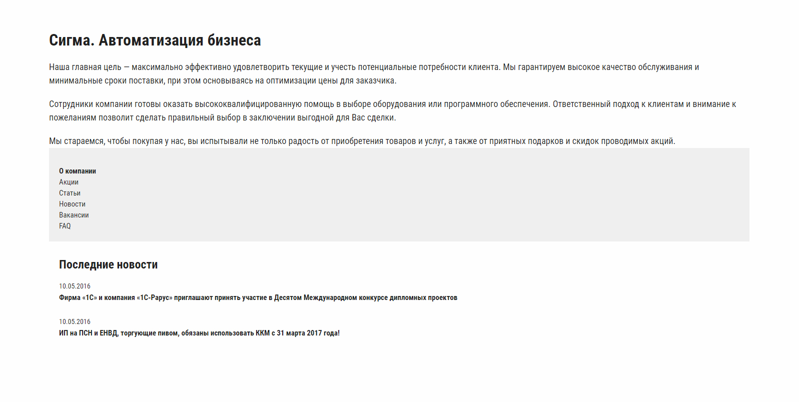
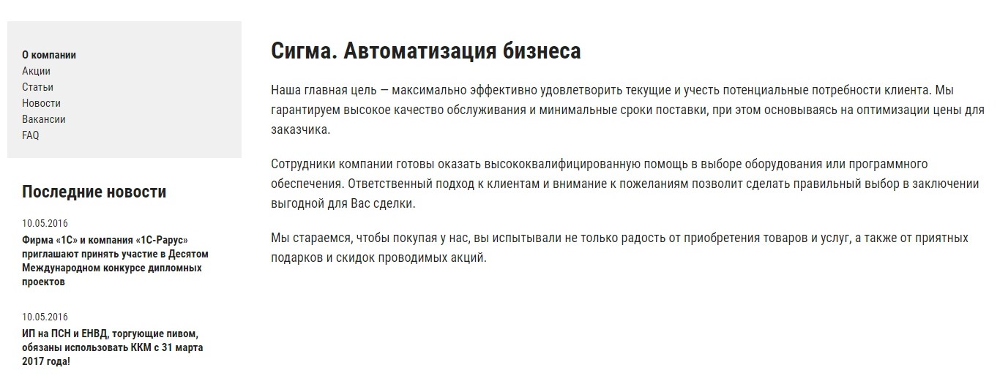
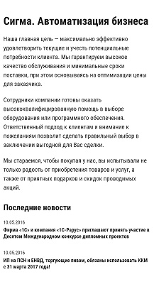

# Страница «О компании»

## Описание

Типичная страница для сайтов различных предприятий — страница «О компании». Такая же страница есть и на сайте компании «Сигма», которая обратилась к вам за помощью. Сейчас эта страница выглядит так:

Нужно изменить верстку таким образом, чтобы на экранах шириной более 960px меню и блок с последними новостями отображались слева от основного контента, а на экранах с шириной менее 961px боковое меню скрывалось.

## Процесс реализации

1. На устройствах с шириной экрана от 961px сделайте так, чтобы у элемента `.aside` ширина всегда была 320px.

2. На устройствах с шириной экрана от 961px сделайте так, чтобы у элемента `.aside`правый внешний отступ всегда был 40px.

3. На устройствах с шириной экрана от 961px сделайте так, чтобы элемент `.content` растягивался по ширине на все доступное пространство.

4. Для устройств с шириной экрана до 960px скройте элемент `.aside__menu`.

5. Протестируйте результат. На устройствах с шириной экрана от 961px элементы должны располагаться следующим образом:

А на устройствах с шириной экрана до 960px — так:

## Реализация

### Локально с использованием git

Внесите изменения в файл `./css/about.css`. Файл уже подключен к документу, поэтому другие файлы изменять не требуется (не изменяйте файл `./css/about-common.css`).

### В песочнице CodePen

Перед началом работы сделайте форк пена на [https://codepen.io/Netology/pen/GOwwaN](https://codepen.io/Netology/pen/GOwwaN).
Внесите изменения во вкладке CSS пена.