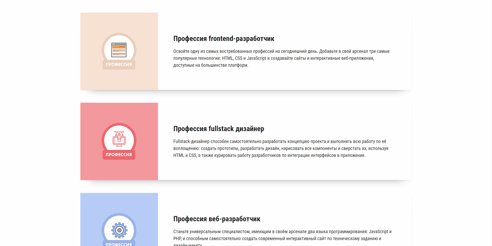
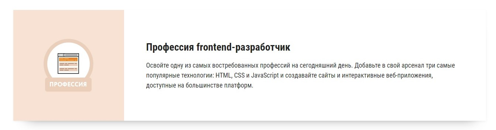
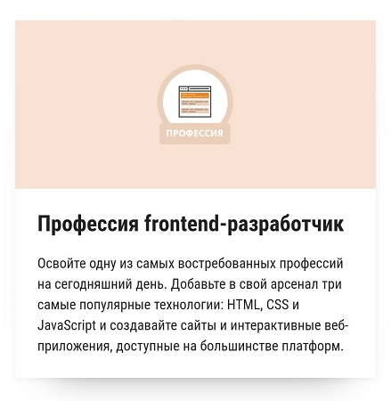

# Детальная страница новости

## Описание

На странице с курсами Нетологии каждый курс представлен отдельным блоком с кратким описанием и изображением-иконкой. Эти блоки выглядят так:
 

Но до этого момента на странице отображались одинаковые изображения для любых устройств с любыми экранами. Самое время заняться версткой и сделать блоки и изображения в них адаптивными.

## Процесс реализации

1. Измените HTML-разметку блоков с курсами так, чтобы на устройствах с шириной экрана до 640px загружались следующие изображения: [front-end-mobile.jpg](https://netology-code.github.io/mq-homeworks/adaptive-images/course-list/img/front-end-mobile.jpg), [fullstack-designer-mobile.jpg](https://netology-code.github.io/mq-homeworks/adaptive-images/course-list/img/fullstack-designer-mobile.jpg) и [web-developer-mobile.jpg](https://netology-code.github.io/mq-homeworks/adaptive-images/course-list/img/web-developer-mobile.jpg). 

2. Сделайте так, чтобы на устройствах с шириной экрана от 641px загружались следующие изображения: [front-end-desktop.jpg](https://netology-code.github.io/mq-homeworks/adaptive-images/course-list/img/front-end-desktop.jpg), [fullstack-designer-desktop.jpg](https://netology-code.github.io/mq-homeworks/adaptive-images/course-list/img/fullstack-designer-desktop.jpg) и [web-developer-desktop.jpg](https://netology-code.github.io/mq-homeworks/adaptive-images/course-list/img/web-developer-desktop.jpg). Также эти изображения должны отобразиться в браузерах, которые не поддерживают тег `<picture>`.

3. Протестируйте результат. На устройствах с шириной экрана от 641px блок с курсом должен выглядеть так: 

А на устройствах до 640px так:

## Реализация

### Локально с использованием git

Внесите изменения в файл `index.html`. Другие файлы изменять не требуется (не изменяйте файл `./css/courses-common.css`).

### В песочнице CodePen

Внесите изменения во вкладке HTML. Перед началом работы сделайте форк пена на [https://codepen.io/Netology/pen/yPQQWq](https://codepen.io/Netology/pen/yPQQWq)
