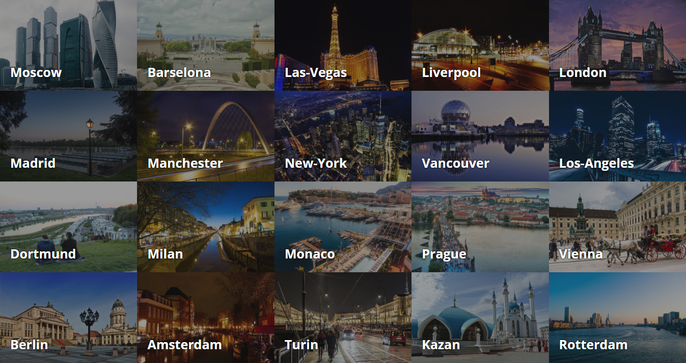
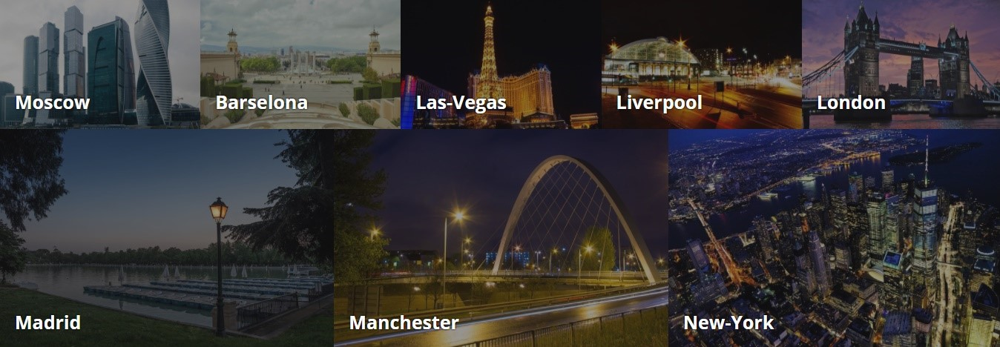
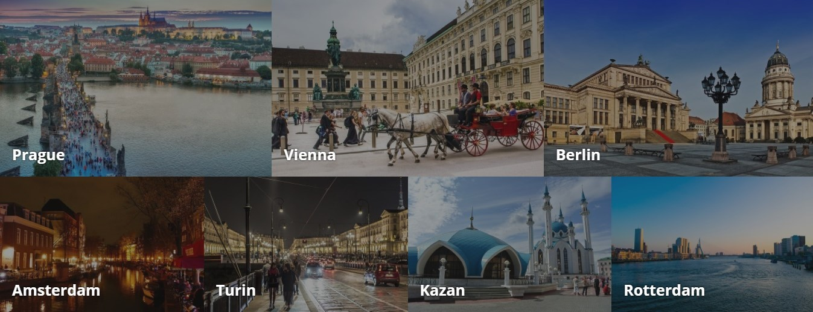
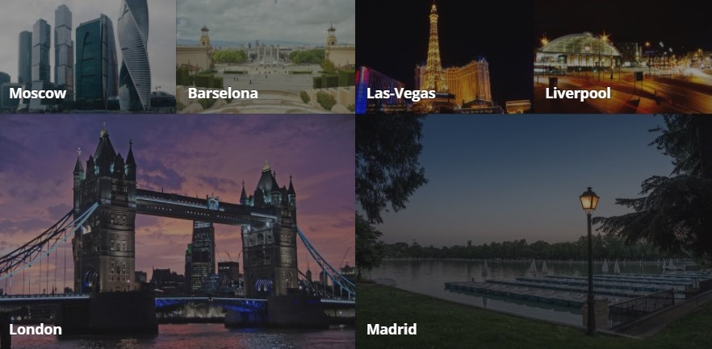
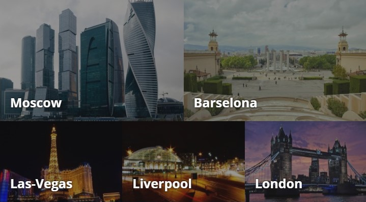
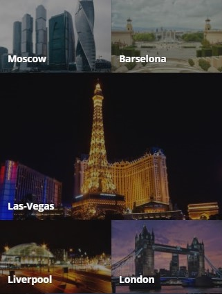
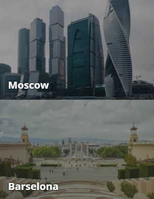

# Улучшение отображения карточек городов для турагентства

## Описание

Уже знакомое вам туристическое агентство захотело немного разнообразить внешний вид своего сайта и, конечно же, обратилось к вам. Как вы помните, сайт турагентства выглядит сейчас так — карточки равномерно заполняют всё пространство страницы:
 

Нужно внести такие изменения в вёрстку, чтобы в зависимости от ширины экрана устройства использовалось различное расположение и размер карточек.

## Процесс реализации

1. Если вы выполняете задание в песочнице CodePen, в начале работы добавьте в тег `<head>` следующий метатег `<meta name="viewport" content="width=device-width, initial-scale=1.0">`. Если вы выполняете задание локально, этот метатег уже добавлен.

2. Для устройств с шириной экрана до `479px` включительно сделайте так, чтобы все карточки выводились на всю ширину экрана.

3. Для устройств с шириной экрана от `480px` и до `640px` включительно сделайте так, чтобы 3, 6, 9, 12, 15 и 18 карточки выводились на всю ширину экрана, а остальные — на половину экрана.

4. Для устройств с шириной экрана от `641px` и до `960px` включительно сделайте так, чтобы 3, 4, 5, 8, 9, 10, 13, 14, 15, 18, 19 и 20 карточки занимали одну треть экрана, а остальные — половину экрана.

5. Для устройств с шириной экрана от `961px` и до `1280px` включительно сделайте так, чтобы 5, 6, 11, 12 карточки занимали половину экрана, а остальные — четвёртую часть экрана.

6. Для устройств с шириной экрана от `1281px` включительно сделайте так, чтобы 6, 7, 8, 14, 15, 16 карточки занимали одну треть экрана. Карточки 17, 18, 19, 20 — четвёртую часть, а остальные — пятую часть экрана.

7. Протестируйте результат. У вас должны получиться следующие варианты расположения карточек:

Карточки с 1 по 8 на экране от `1281px`:

Карточки с 14 по 20 на экране от `1281px`:

Карточки с 1 по 6 на экране от `961px` и до `1280px`:

Карточки с 1 по 5 на экране от `641px` и до `960px`: 

Карточки с 1 по 5 на экране от `480px` и до `640px`:

Карточки 1 и 2 на экране до `479px`:

## Реализация

Внесите изменения во вкладке CSS. [Перед началом работы сделайте форк пена](https://codepen.io/Netology/pen/rYQQgP).
