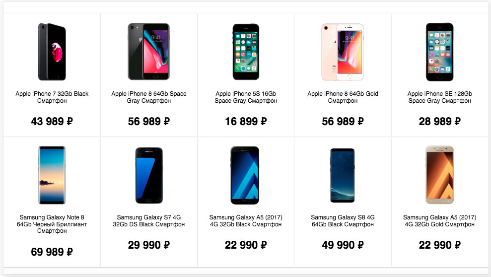
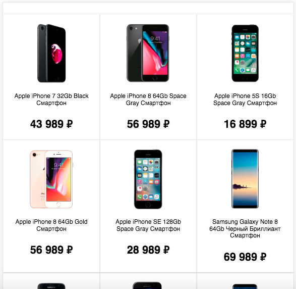
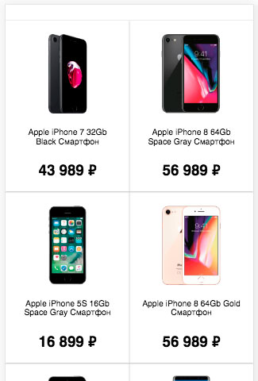
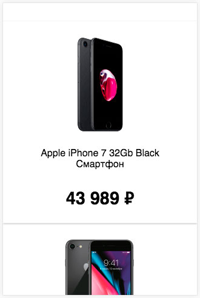

# Список товаров в интернет-магазине

## Описание

Вам написали из интернет-магазина, торгующего мобильными телефонами, и попросили помочь с проблемой. Все пользователи, которые заходят на сайт с мобильных телефонов и планшетов, уходят, не сделав покупку. Дело в том, что страница не адаптирована для отображения на различных устройствах и список товаров очень неудобен в использовании. 

Нужно исправить верстку так, чтобы сайтом было удобно пользоваться с любого устройства, уменьшая количество карточек в ряду при уменьшении размера экрана. Сейчас страница для десктопных устройств выглядит так, карточки выстраиваются по пять в ряд:
 

Для устройств с шириной экрана в диапазоне от `960px` до `1300px` включительно нужно уменьшить количество карточек в ряду до четырех:

Для устройств с шириной экрана в диапазоне от `768px` до `959px` включительно должно быть по три карточки в ряду:

Для устройств с шириной экрана в диапазоне от `376px` до `767px` включительно — две карточки в ряду:

И наконец, для устройств с шириной экрана от `375px` и меньше — по одной карточке в ряду:

## Процесс реализации

1. Если вы выполняете задание в песочнице CodePen - в начале работы добавьте в тег `<head>` следующий мета-тег `<meta name="viewport" content="width=device-width, initial-scale=1.0">`.

2. Для устройств, у которых ширина экранов от `1301px` и больше, сделайте так, чтобы в ряду отображалось по 5 карточек.

3. Для устройств, у которых ширина экранов в диапазоне от `960px` до `1300px` включительно, сделайте так, чтобы в ряду отображалось по 4 карточки.

4. Для устройств, у которых ширина экранов в диапазоне от `768px` до `959px` включительно, сделайте так, чтобы в ряду отображалось по 3 карточки.

5. Для устройств, у которых ширина экранов в диапазоне от `376px` до `767px` включительно, сделайте так, чтобы в ряду отображалось по 2 карточки.

6. Для устройств, у которых ширина экранов от `375px` и меньше, сделайте так, чтобы в ряду отображалось по 1 карточке.

7. Протестировать решение можно, постепенно уменьшая ширину окна браузера. Вы должны увидеть, как количество элементов в ряду уменьшается от 5 до 1.

## Реализация

Внесите изменения во вкладке CSS. Перед началом работы сделайте форк пена на [https://codepen.io/Netology/pen/wPqXwv](https://codepen.io/Netology/pen/wPqXwv)
