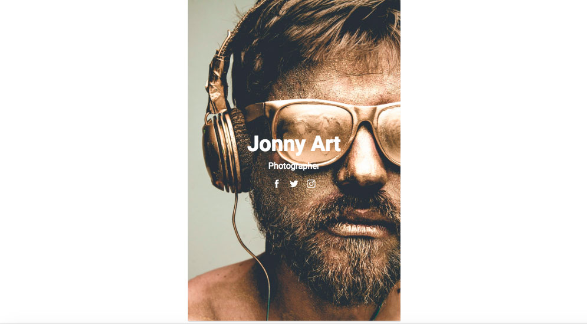
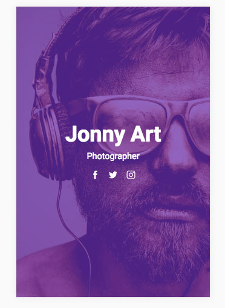
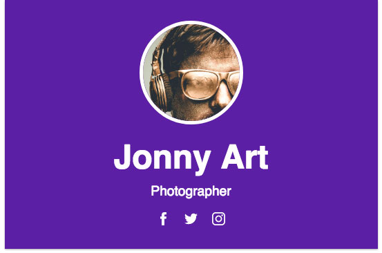
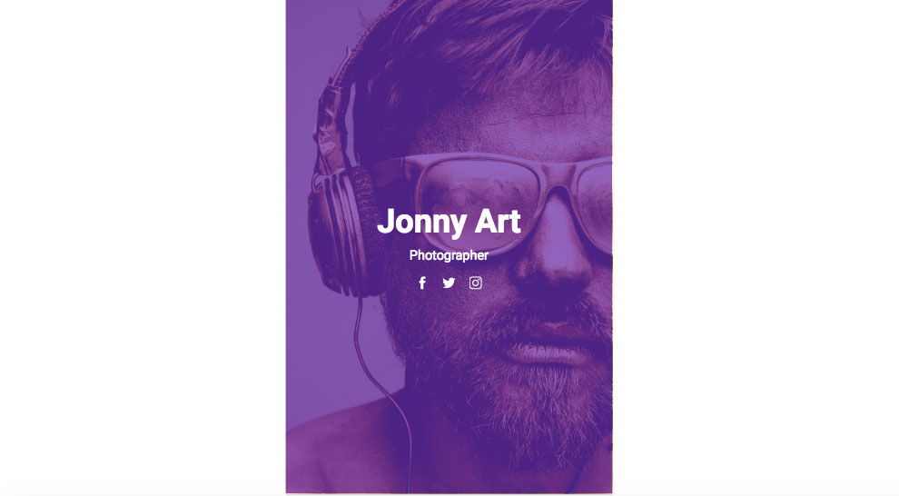
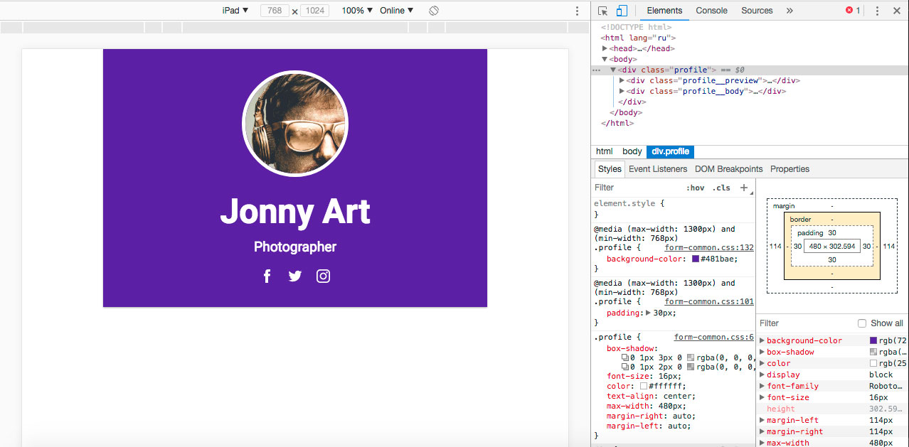
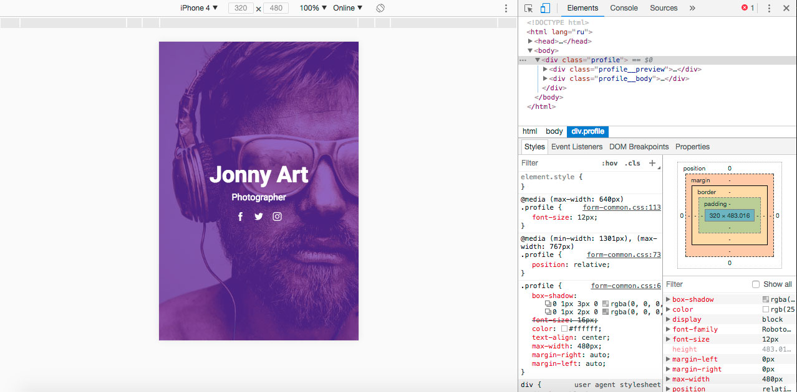

# Карточка пользователя

## Описание

Заказы от фотографов продолжают поступать. Поэтому вы решили создать сайт, на котором каждый фотограф сможет разместить свое портфолио. Информация о каждом из фотографов будет представлена в виде карточек с контактными данными. Сейчас при всех разрешениях экрана такая карточка выглядит одинаково:
 

Нужно изменить верстку таким образом, чтобы на устройствах с шириной экрана от `767px` и меньше или от `1301px` и больше карточка выглядела так: 

А на устройствах с шириной экрана в диапазоне от `768px` до `1300px` включительно — так:

## Процесс реализации

1. Если вы выполняете задание в песочнице CodePen - в начале работы добавьте в тег `<head>` следующий мета-тег `<meta name="viewport" content="width=device-width, initial-scale=1.0">`. Если вы выполняете задание локально - данный мета-тег уже добавлен.

2. Для элемента с классом `profile__preview:before` добавить прозрачность `0.7` и цвет фона `#481bae` только для устройств, у которых ширина экрана от `767px` и меньше или от `1301px` и больше.

3. Для элемента с классом `profile` добавить цвет фона `#481bae` только для устройств, у которых ширина экрана в диапазоне от `768px` до `1300px` включительно. 

4. Для элемента с классом `profile__preview` добавить ширину и высоту по `140px`, сплошную рамку цветом `#ffffff` и шириной `5px` только для устройств, у которых ширина экрана в диапазоне от `768px` до `1300px` включительно. 

5. Закруглить углы у элемента с классом `profile__preview` только для устройств, у которых ширина экрана в диапазоне от `768px` до `1300px` включительно. 

6. Протестируйте на обычном мониторе. У вас должно получиться так:

6. Протестируйте результат в эмуляторе, выбрав iPad. У вас должно получиться так:

7. Протестируйте результат в эмуляторе, выбрав iPhone 4. У вас должно получиться так:

## Реализация

Внесите изменения во вкладке CSS. Перед началом работы сделайте форк пена на [https://codepen.io/Netology/pen/WXEvVX](https://codepen.io/Netology/pen/WXEvVX)
