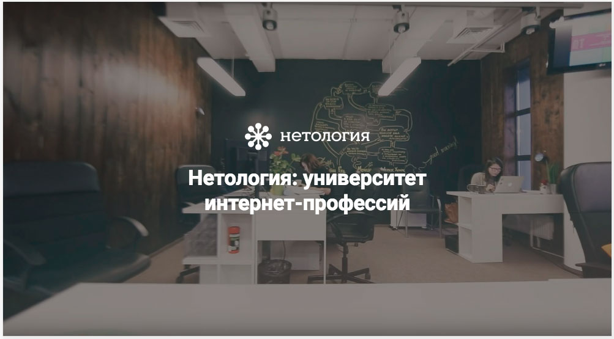
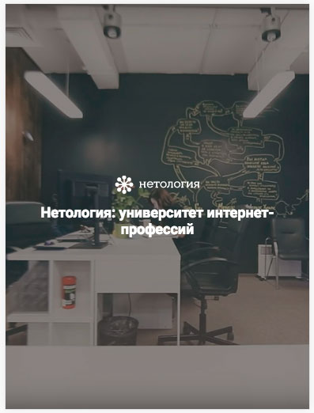
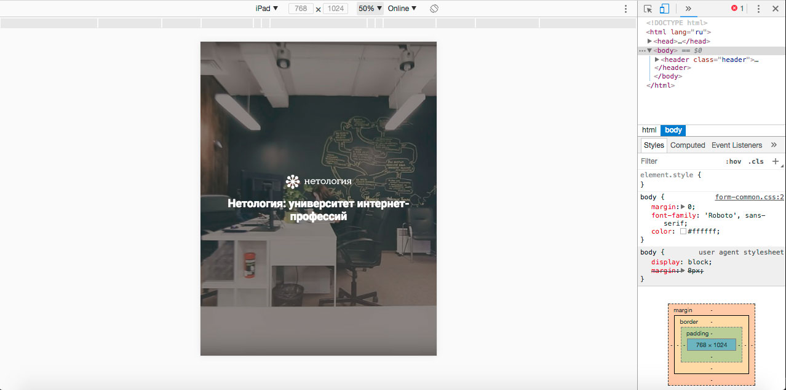
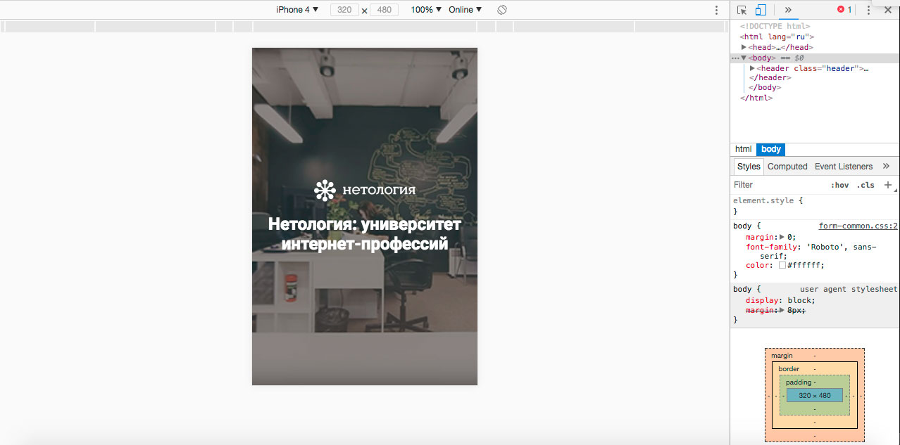

# Блок с приветствием для Нетологии

## Описание

Продолжаем работу над редизайном сайта Нетологии: на очереди блок с приветствием. Нужно изменить верстку так, чтобы для разных разрешений экрана блок выглядел по-разному: изменялся размер шрифта и использовались фоновые изображения разного размера. Сейчас страница выглядит так:

Для устройств с шириной экрана в дипазоне от `641px` до `1300px` включительно измените верстку так, чтобы страница выглядела так:

А для мобильных устройств с шириной экрана от `640px` и меньше — так: 

## Процесс реализации

1. Если вы выполняете задание в песочнице CodePen - в начале работы добавьте в тег `<head>` следующий мета-тег `<meta name="viewport" content="width=device-width, initial-scale=1.0">`. Если вы выполняете задание локально - данный мета-тег уже добавлен.

2. Измените существующий код так, чтобы существующие свойства `font-size` и `background-image` элемента с классом `header` применялись только для устройств, у которых ширина экрана от `1301px` и больше.

3. Для устройств, у которых ширина экрана в дипазоне от `641px` до `1300px` включительно, рассчитайте `font-size` элемента `.header` так, чтобы у элемента `.header__slogan` `font-size` был `36px`. Свойство `font-size` у элемента `.header__slogan` изменять не надо.

4. Для устройств, у которых ширина экрана от `640px` и меньше, рассчитайте `font-size` элемента `.header` так, чтобы у элемента `.header__slogan` `font-size` был `24px`. Свойство `font-size` у элемента `.header__slogan` изменять не надо.

5. Для устройств, у которых ширина экрана в дипазоне от `641px` до `1300px` включительно, добавьте фоновое изображение [netology_1200.jpg](https://netology-code.github.io/mq-homeworks/adaptive-layout/welcome-block/img/netology_1200.jpg) у элемента с классом `header`.

6. Для устройств, у которых ширина экрана от `640px` и меньше, добавьте фоновое изображение [netology_600.jpg](https://netology-code.github.io/mq-homeworks/adaptive-layout/welcome-block/img/netology_600.jpg) у элемента с классом `header`.

7. Протестируйте результат в эмуляторе, выбрав iPad:
 

У вас должно загружаться фоновое изображение `netology_1200.jpg`, а размер шрифта элемента с классом `header__slogan` должен быть `36px`.

7. Протестируйте результат в эмуляторе, выбрав iPhone 4:

У вас должно загружаться фоновое изображение `netology_600.jpg`, а размер шрифта элемента с классом `header__slogan` должен быть `24px`.

## Реализация

Перед началом работы сделайте форк пена на [https://codepen.io/Netology/pen/aVydom](https://codepen.io/Netology/pen/aVydom). Внесите изменения во вкладке CSS пена.
