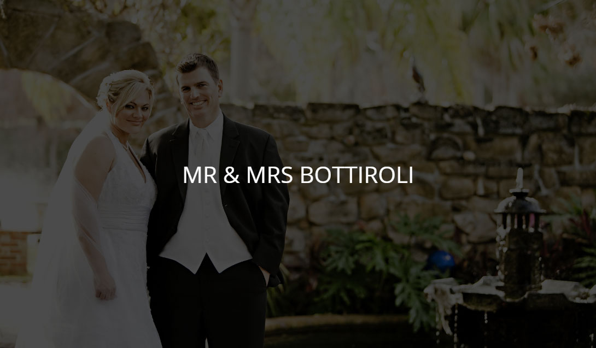
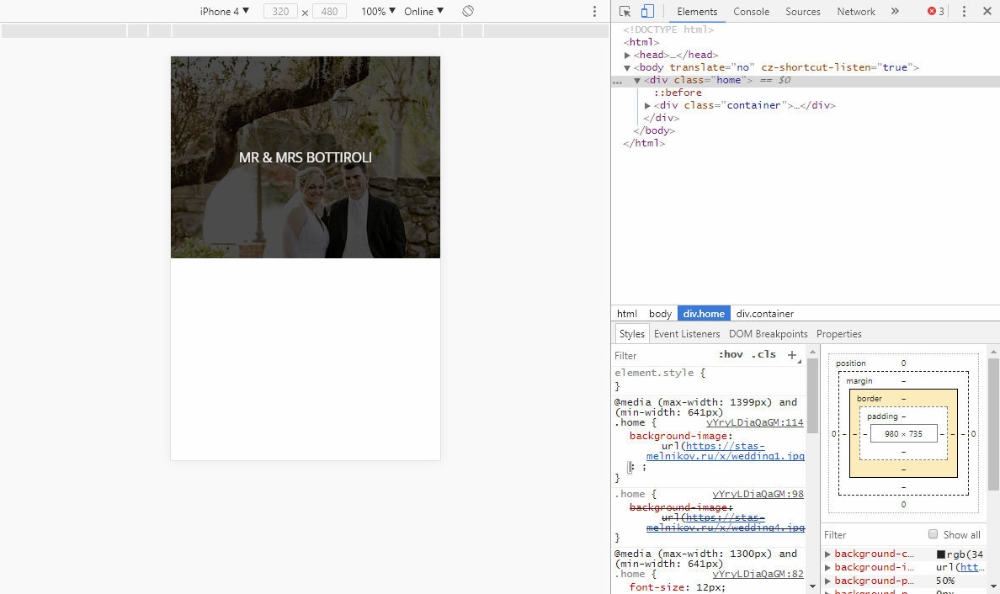
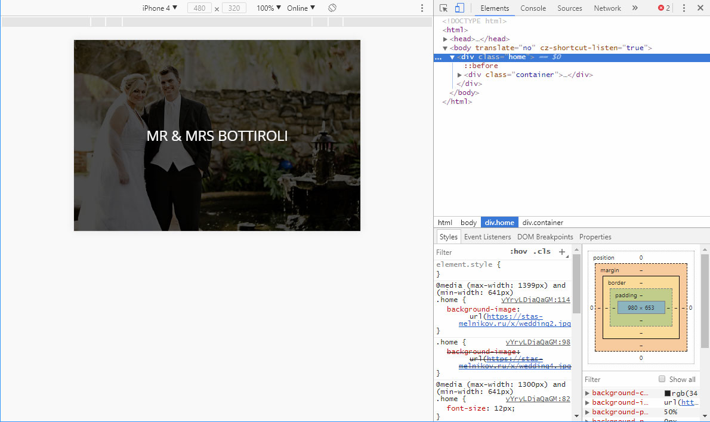

# Веб-версия карточки семейного альбома

## Описание

Ваш лучший друг наконец сделал предложение своей девушке. Вы ужасно рады за пару и хотите подарить что-нибудь особенное в день их свадьбы. Конечно же, лучший подарок — сделанный собственными руками, например, семейный альбом в виде веб-страницы. Карточка с фотографией уже готова, так она выглядит на десктопных устройствах:

Однако сейчас для любых устройств используется одна и та же фоновая фотография. Нужно изменить верстку так, чтобы для устройств с разными разрешениями и ориентацией экрана использовались разные фоновые изображения.

## Процесс реализации

1. Если вы выполняете задание в песочнице CodePen - в начале работы добавьте в тег `<head>` следующий мета-тег `<meta name="viewport" content="width=device-width, initial-scale=1.0">`. Если вы выполняете задание локально - данный мета-тег уже добавлен

2. Сделайте так, чтобы изображение [wedding4.jpg](https://netology-code.github.io/mq-homeworks/adaptive-typography/family-album/img/wedding4.jpg) загружалось только на устройствах с шириной экрана больше `1399px`.

3. Сделайте так, чтобы изображение [wedding3.jpg](https://netology-code.github.io/mq-homeworks/adaptive-typography/family-album/img/wedding3.jpg) загружалось только на устройствах с шириной экрана больше `640px` и меньше `1400px`.

4. Сделайте так, чтобы изображение [wedding2.jpg](https://netology-code.github.io/mq-homeworks/adaptive-typography/family-album/img/wedding2.jpg) загружалось только на устройствах с шириной экрана меньше `641px`, находящихся в пейзажной ориентации.

5. Сделайте так, чтобы изображение [wedding1.jpg](https://netology-code.github.io/mq-homeworks/adaptive-typography/family-album/img/wedding1.jpg) загружалось только на устройствах с шириной экрана меньше `641px`, находящихся в портретной ориентации.

6. Протестируйте результат в эмуляторе, выбрав iPhone 4. В портретной ориентации должно загрузиться следующее изображение: 

А в пейзажной — такое:

## Реализация

Перед началом работы сделайте форк пена на [https://codepen.io/Netology/pen/eeVveb](https://codepen.io/Netology/pen/eeVveb).
Внесите изменения во вкладке CSS пена.
