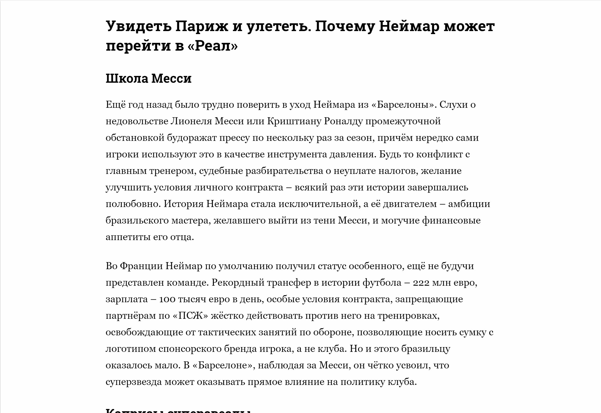
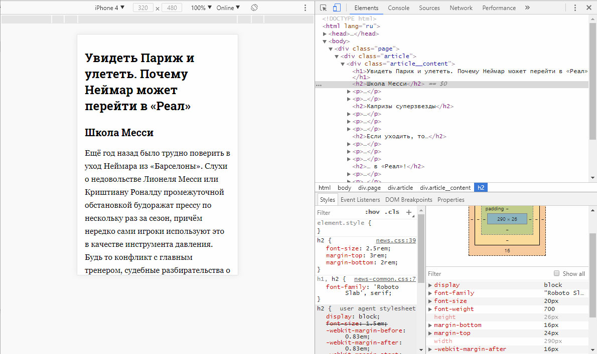

# Детальная страница новости

## Описание

Ваш любимый сайт новостей `краткие-новости.рф` в восторге от вашего предыдущего предложения по изменению верстки сайта. И сейчас они предлагают продолжить работу над вторым проектом компании — `детальные-новости.рф`. Нужно сделать сайт максимально удобным для чтения с любого устройства. Сейчас сайт выглядит так:
 

Нужно изменить верстку, используя для указания размеров относительные единицы `rem`, чтобы размер шрифта и отступов адаптировался к размеру экрана.

## Процесс реализации

1. Если вы выполняете задание в песочнице CodePen - в начале работы добавьте в тег `<head>` следующий мета-тег `<meta name="viewport" content="width=device-width, initial-scale=1.0">`. 

2. Для устройств с шириной экрана больше `767px` рассчитайте размер шрифта элемента `html` в процентах так, чтобы получилось `10px` при стандартных настройках браузера.

3. Рассчитайте размер шрифта элемента `h1` в единицах `rem`.

4. Рассчитайте размер шрифта элемента `h2` в единицах `rem`.

5. Рассчитайте `margin-top` и `margin-bottom` элемента `h2` в единицах `rem`.

6. Рассчитайте размер шрифта элемента `p` в единицах `rem`.

7. Рассчитайте `margin-bottom` элемента `p` в единицах `rem`.

8. Для устройств с шириной экрана меньше `768px` рассчитайте размер шрифта элемента `html` в процентах.

9.  Протестируйте результат в эмуляторе, выбрав iPhone 4. Если вы сделали все правильно, то размер шрифта элемента `h2` должен быть `20px`, а `margin-top` и `margin-bottom` — `24px` и `16px` соответственно: 

## Реализация

Внесите изменения во вкладке CSS. Перед началом работы сделайте форк пена на [https://codepen.io/Netology/pen/vWdxzy](https://codepen.io/Netology/pen/vWdxzy)
