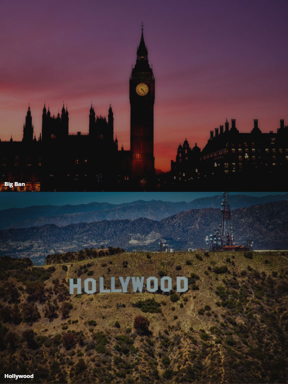
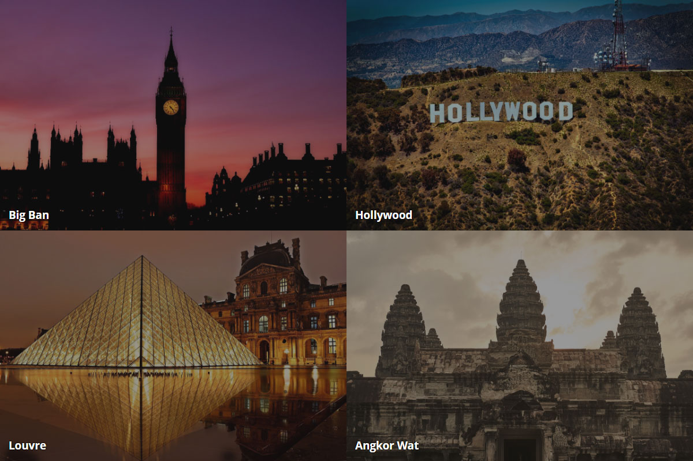
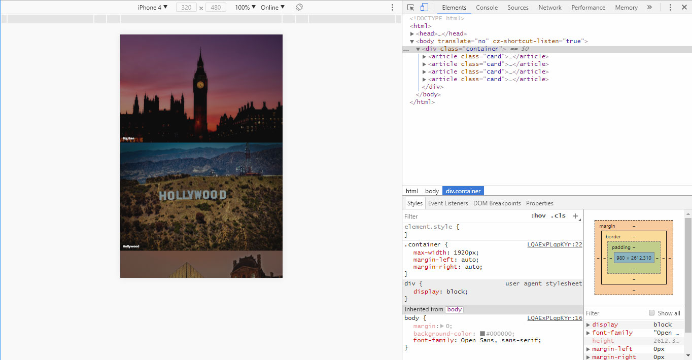

# Достопримечательности мира

## Описание

В последнее время вы много путешествовали по всему миру и побывали во многих интересных местах. Чтобы впечатления оставались такими же свежими, как и сразу после поездки, вы решили создать веб-страницу с фотографиями всех посещенных достопримечательностей. Верстка страницы для устройств, находящихся в портретной (вертикальной) ориентации экрана, уже готова, страница выглядит так:
 

Осталось изменить верстку таким образом, чтобы при изменении ориентации экрана на пейзажную карточки выстраивались в две колонки и страница выглядела так:

## Процесс реализации

1. Если вы выполняете задание в песочнице CodePen - в начале работы добавьте в тег `<head>` следующий мета-тег `<meta name="viewport" content="width=device-width, initial-scale=1.0">`. Если вы выполняете задание локально - данный мета-тег уже добавлен.

2. Создайте медиа-запрос для устройств, которые находятся в пейзажной ориентации.

3. Для устройств, которые находятся в пейзажной ориентации, расположите карточки в две колонки.

4. Протестируйте результат в эмуляторе, выбрав iPhone 4. В портретной ориентации карточки должны располагаться друг под другом:

А в пейзажной ориентации — в две колонки:

## Реализация

Внесите изменения во вкладке CSS. Перед началом работы сделайте форк пена на [https://codepen.io/Netology/pen/zPRNJj](https://codepen.io/Netology/pen/zPRNJj)
