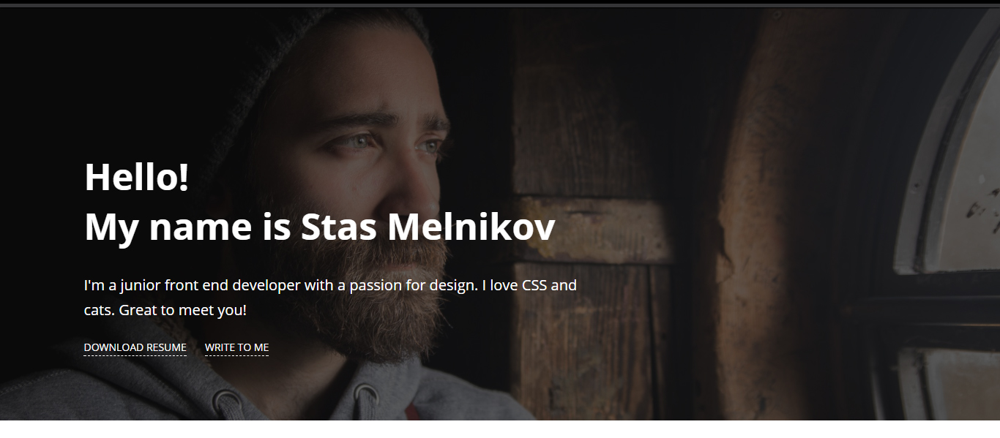
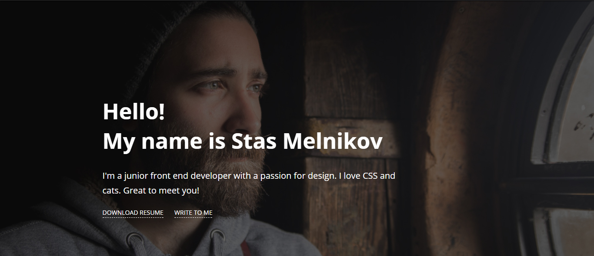
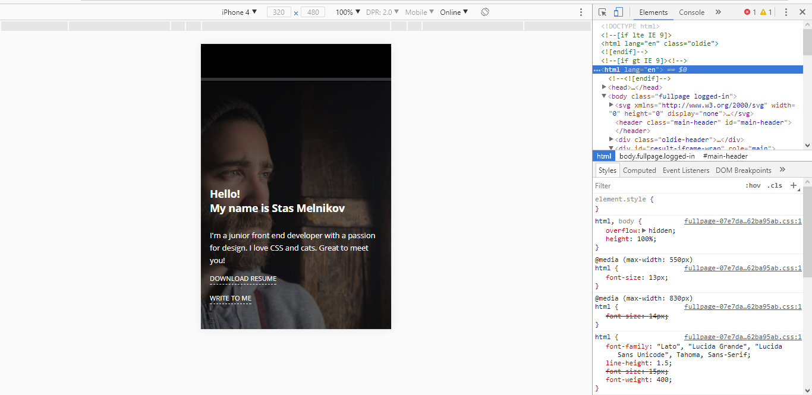

# Заглушка для сайта фронтенд-разработчика

## Описание

Перед работой многие клиенты просят ссылку на портфолио, поэтому вы задумались над созданием собственного сайта — с вашими работами, перечнем навыков и публикаций, контактной информацией. На время, пока сайт будет в разработке, было решено повесить на сайт заглушку с основными данными. В текущем состоянии фоновое изображение не растягивается на всю высоту экрана:

Нужно доработать страницу так, чтобы на любом устройстве фоновое изображение занимало весь экран.

## Процесс реализации

1. Если вы выполняете задание в песочнице CodePen - в начале работы добавьте в тег `<head>` следующий мета-тег `<meta name="viewport" content="width=device-width, initial-scale=1.0">`. Если вы выполняете задание локально - данный мета-тег уже добавлен.

2. Для элемента с классом `welcome` задайте такую минимальную высоту, чтобы блок полностью занимал экран пользователя на любом устройстве.

3. Для элемента `.container` задайте верхний и нижний внутренний отступ, равные 10% от высоты вьюпорта. Свойства должны работать для устройств с шириной экрана до `1023px`.

4. Для элемента с классом `welcome__info` задайте левый внутренний отступ, равный 35% от высоты вьюпорта. Свойства должны работать для устройств с шириной экрана от `1024px`.

5. Протестируйте задание на нескольких экранах. Например, на экране с шириной `1366` пикселей страница должна выглядеть так:

5. Используя эмулятор, протестируйте верстку на iPhone4:

Не требуется вносить какие-либо другие правки в CSS или писать дополнительные правила. Также не изменяйте HTML-разметку.

## Реализация

В ходе решения этой задачи не изменяйте HTML-разметку.

Внесите изменения во вкладке CSS. Перед началом работы сделайте форк пена на [https://codepen.io/Netology/pen/BmVdez](https://codepen.io/Netology/pen/BmVdez)
