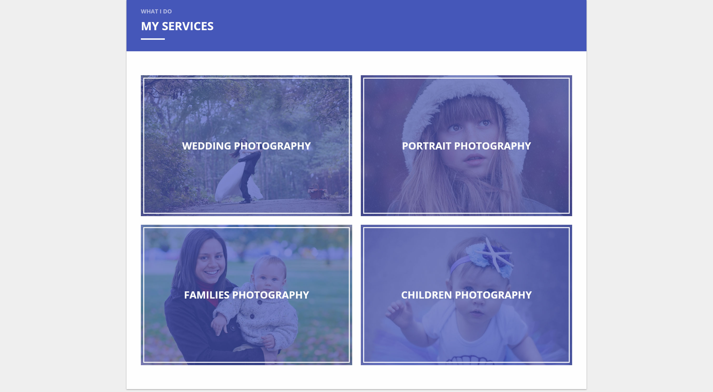
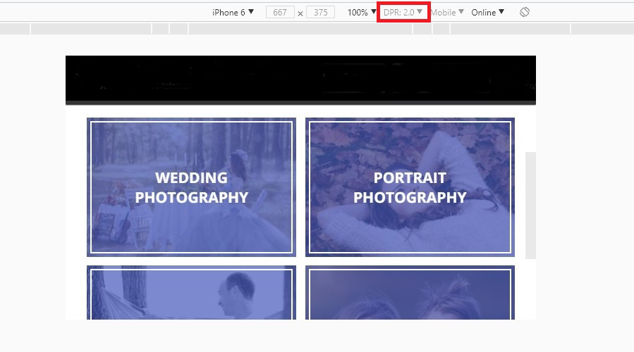
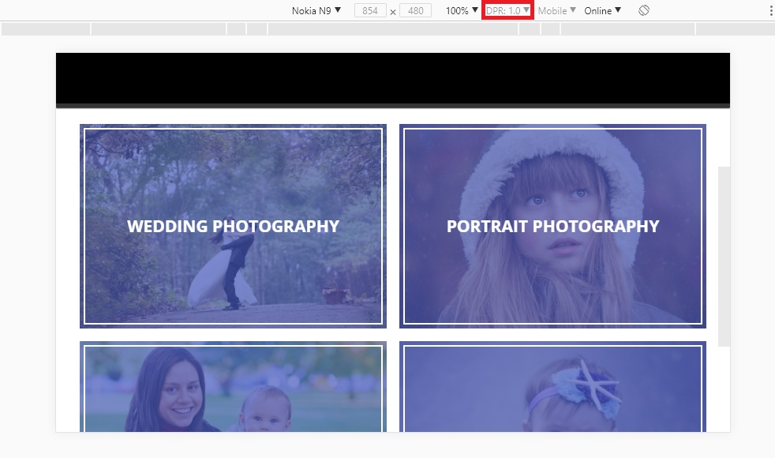

# Верстка блока «Услуги» для устройств с повышенной плотностью пикселя

## Описание

Вы уже работали над сайтом известного семейного фотографа:

Теперь настало время усовершенствовать его, оптимизировав изображения под экраны с повышенной плотностью пикселя — ведь очень важно, чтобы фотографии смотрелись отлично на любом устройстве.

## Процесс реализации

1. Если вы выполняете задание в песочнице CodePen - в начале работы добавьте в тег `<head>` следующий мета-тег `<meta name="viewport" content="width=device-width, initial-scale=1.0">`. Если вы выполняете задание локально - данный мета-тег уже добавлен.

2. Для блока «WEDDING PHOTOGRAPHY» сделайте так, чтобы браузер загружал изображение [wedding.jpg](https://netology-code.github.io/mq-homeworks/breakpoints/services-retina/img/wedding.jpg) для устройств с DPR, равным 1, а для устройств с DPR, равным 2, — [wedding-retina.jpg](https://netology-code.github.io/mq-homeworks/breakpoints/services-retina/img/wedding-retina.jpg).

3. Для блока «PORTRAIT PHOTOGRAPHY» сделайте так, чтобы браузер загружал изображение [portrait.jpg](https://netology-code.github.io/mq-homeworks/breakpoints/services-retina/img/portrait.jpg) для устройств с DPR, равным 1, а для устройств с DPR, равным 2, — [portrait-retina.jpg](https://netology-code.github.io/mq-homeworks/breakpoints/services-retina/img/portrait-retina.jpg).

4. Для блока «FAMILIES PHOTOGRAPHY» сделайте так, чтобы браузер загружал изображение [family.jpg](https://netology-code.github.io/mq-homeworks/breakpoints/services-retina/img/family.jpg) для устройств с DPR, равным 1, а для устройств с DPR, равным 2, — [family-retina.jpg](https://netology-code.github.io/mq-homeworks/breakpoints/services-retina/img/family-retina.jpg).

5. Для блока «CHILDREN PHOTOGRAPHY» сделайте так, чтобы браузер загружал изображение [children.jpg](https://netology-code.github.io/mq-homeworks/breakpoints/services-retina/img/children.jpg) для устройств DPR, равным 1, а для устройств с DPR, равным 2, — [children-retina.jpg](https://netology-code.github.io/mq-homeworks/breakpoints/services-retina/img/children-retina.jpg).

6. Протестируйте загрузку изображений, используя эмулятор в веб-инспекторе. Сначала выберите устройство с DPR, равным 2. Например, iPhone6:

Обязательно перезагрузите страницу после включения настроек эмулятора, чтобы загрузились правильные изображения.

6. Далее выберите устройство с DPR, равным 1. Например, Nokia N9:

Не требуется вносить какие-либо другие правки в HTML. Также не изменяйте CSS.

## Реализация

В ходе решения этой задачи не изменяйте CSS.

Внесите изменения во вкладке HTML. Перед началом работы сделайте форк пена на [https://codepen.io/Netology/pen/bYKrPB](https://codepen.io/Netology/pen/bYKrPB)
