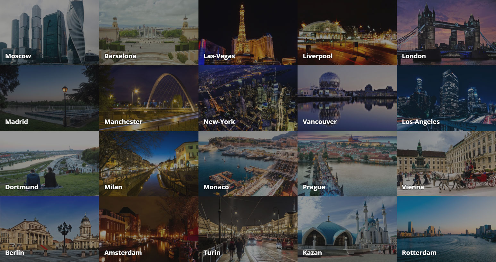
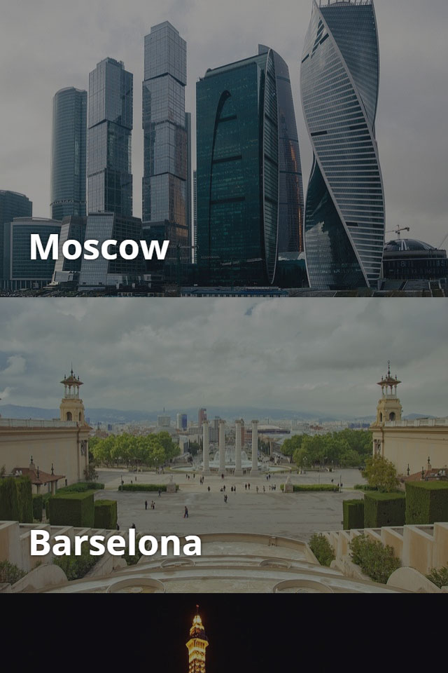

# Туристическое агентство

## Описание

Вас хочет нанять на работу крупное туристическое агентство. Основная часть пользователей сервиса использует его с мобильных устройств, поэтому работа над ним идет по принципу Mobile First. 

В качестве тестового задания вам предложено изменить имеющийся код вывода карточек городов согласно принципу Mobile First. При этом внешне результат не должен поменяться. Сейчас страница с карточками на десктопных экранах выглядит так:

А на экранах мобильных устройств — так:

## Процесс реализации

1. Перепишите код согласно принципу Mobile First.

2. Отсортируйте медиа-запросы согласно принципу Mobile First.

### Локально с использованием git

Внесите изменения в файл `./css/page.css`. Файл уже подключен к документу, поэтому другие файлы изменять не требуется (не изменяйте файл `./css/page-common.css`).

### В песочнице CodePen

Внесите изменения во вкладке CSS. Перед началом работы сделайте форк пена на [https://codepen.io/Netology/pen/WXyEqp](https://codepen.io/Netology/pen/WXyEqp)
