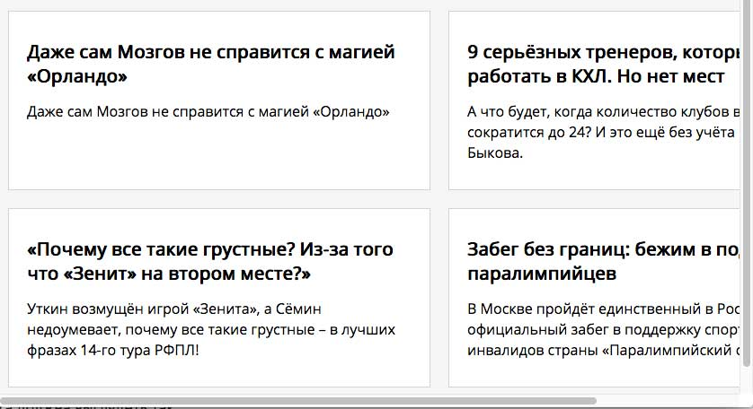
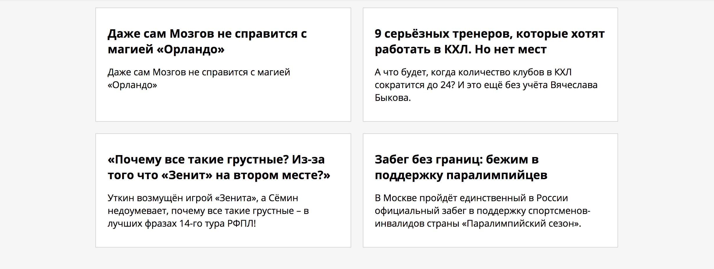
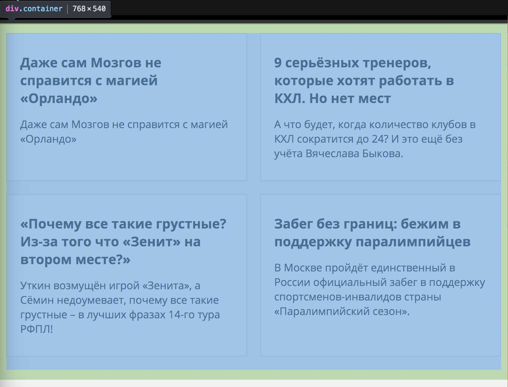
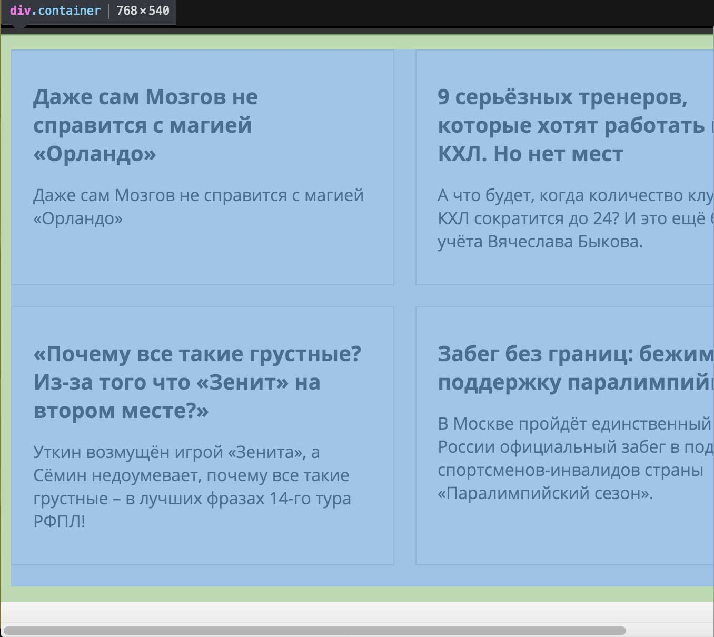
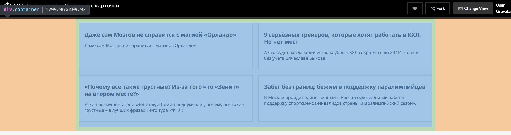

# Новостные карточки

## Описание

После увольнения генерального директора крупного СМИ правление выделило дополнительный бюджет на развитие их веб-сайта.

Перед вами стоит задача сделать резиновой страницу с карточками свежих новостей из разных источников.

Сейчас, если открыть верстку в окне браузера шириной `768px`, то часть карточек окажется за пределами окна и появится полоса горизонтальной прокрутки:

 
Избавьтесь от прокрутки, чтобы все карточки можно было прочитать сразу:

При этом важно сохранить бордер, внутренние и внешние отступы карточки в `px` неизменными, независимо от ширины контейнера и карточек (это личная просьба дизайнера).

Также нужно сделать, чтобы контейнер тянулся от `768px` до `1300px`.

Верстка должна выглядеть так:

## Процесс реализации

1. Рассчитайте значение свойства `width` блока с классом `container` в процентах. Укажите такую ширину блока с классом `container`, чтобы она была равна `960px` при ширине окна `1366px`. 

2. Укажите значения минимальной и максимальной ширины блока с классом `container`. Ширина этого блока должна достигать своего наименьшего значения `768px` и наибольшего значения `1300px`. Внутренние отступы блока должны оставаться неизменными.

3. Измените значение свойства `width` для блоков с классом `card` таким образом, чтобы в строчку помещалось по две карточки и это значение учитывало заданные абсолютно `margin`, `padding` и `border` блоков (независимо от ширины блока внутренние отступы должны оставаться равными `30px` сверху и снизу и `20px` по бокам, ширина обводки &mdash; `1px`, внешние отступы &mdash; `20px` снизу и `10px` сбоку.)

4. Проверьте правильность своего решения, изменяя ширину окна браузера.
При ширине окна `768px` блок должен иметь ширину как на скриншоте:

При сужении окна менее `768px` должна появиться горизонтальная прокрутка:

При большом размере окна браузера (например, `1920px`) `.container` должен иметь ширину, как на скриншоте:

Не требуется вносить какие-либо другие правки в CSS или писать дополнительные правила. Также не изменяйте HTML-разметку.

## Реализация

В ходе решения этой задачи не изменяйте HTML-разметку.

Внесите изменения во вкладке CSS. Перед началом работы сделайте форк пена на [https://codepen.io/Netology/pen/pWMwJN](https://codepen.io/Netology/pen/pWMwJN?editors=0100#0)
