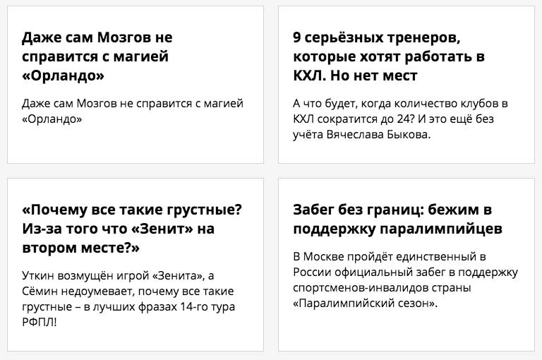

# Новостные карточки

## Описание
Во внутренней системе управления крупного СМИ есть страница с карточками свежих новостей из разных источников.
Раньше с этой системой можно было работать только с настольного компьютера или ноутбука. Но недавно всем журналистам были выданы служебные планшеты, чтобы они могли следить за трендами, находясь «в полях».

Сейчас, если открыть верстку в окне браузера шириной 768px, то часть карточек окажется за пределами окна и появится полоса горизонтальной прокрутки:

 
Избавьтесь от прокрутки, чтобы все карточки можно было бы прочитать сразу:

При этом важно сохранить бордер, внутренние и внешние отступы карточки в px неизменными независимо от ширины контейнера и карточек (это личная просьба дизайнера).

А также нужно сделать, чтобы контейнер тянулся от  `768px` и до `1300px`.

Верстка должна выглядеть так:

## Процесс реализации

1. Укажите значения минимальной и максимальной ширины блока `.container`, учитывая, что полоса горизонтальной прокрутки должна появляться для ширины окна браузера, меньшей `768px`, и блок должен переставать тянуться при ширине окна `1300px`.
Внутренние отступы должны оставаться неизменными (10px слева и справа).

2. Измените свойство `width` блока `.container`. Выберите такое значение в %, при котором ширина блока будет равняться `960px` при ширине окна `1366px` и при неизменных внутренних отступах 10px слева и справа (также не забудьте перед расчетом вычесть ширину скроллбара браузера). 

3. Замените значение свойства `width` для блоков с классом `.card` таким значением, чтобы в строчку помещались по две карточки и это значение учитывало бы заданные абсолютно `margin`, `padding` и `border` блоков
 (независимо от ширины блока внутренние отступы должны оставаться равными `30px` сверху и снизу и `20px` по бокам, ширина обводки &mdash; `1px`, внешние отступы &mdash; `20px` снизу и `10px` сбоку.)

Не требуется вносить какие-либо другие правки в CSS или писать дополнительные правила. Также не изменяйте HTML-разметку.

## Реализация

В ходе решения этой задачи не изменяйте HTML-разметку.

### Локально с использованием git

Внесите изменения в файл `./css/news.css`. Файл уже подключен к документу, поэтому другие файлы изменять не требуется (не изменяйте файл `./css/news-common.css`).

### В песочнице CodePen

Внесите изменения во вкладке CSS. Перед началом работы сделайте форк пена на [https://codepen.io/Netology/pen/pWMwJN](https://codepen.io/Netology/pen/pWMwJN?editors=0100#0)
