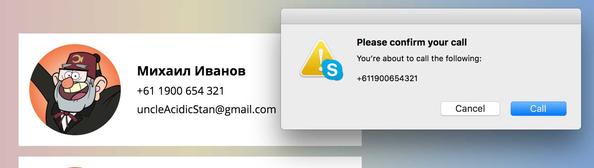
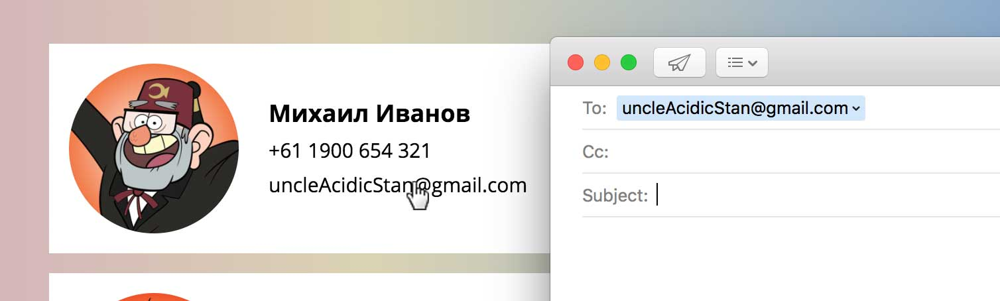

# Телефонная книга

## Описание

Крупное рекламное агентство запустило в России масштабную рекламную кампанию по продвижению полнометражного фильма [«Гравити Фолз»](https://ru.wikipedia.org/wiki/%D0%93%D1%80%D0%B0%D0%B2%D0%B8%D1%82%D0%B8_%D0%A4%D0%BE%D0%BB%D0%B7).
Частью кампании является интерактивное приложение в виде телефонной книжки с контактами главных героев мультика. Пользователю дана возможность позвонить по телефону или написать электронное письмо и лично пообщаться с персонажем.

Сейчас ключевой функционал отсутствует, и для звонка или письма приходится копировать контакт и вставлять его в другом приложении. Это неудобно, и конверсия заметно ниже той, что ожидалась.

Вам поставлена задача сделать строки с телефоном и электронной почтой интерактивными: при нажатии на номер телефона должно появляться предложение позвонить:
 

А при нажатии на почту — открываться почтовый клиент:

Очень важно, чтобы при этом внешний вид строк не изменился.

## Процесс реализации

1. Измените HTML-разметку таким образом, чтобы строка с номером телефона стала интерактивной. При клике по этой строке должно появляться предложение о наборе номера.

2. Измените HTML-разметку таким образом, чтобы строка с адресом электронной почты стала интерактивной. При клике по этой строке должен открываться почтовый клиент с этим адресом в поле «Кому» и с темой письма «Люблю Гравити Фолз!».

3. Напишите CSS-правило для того, чтобы отменить встроенные стили интерактивных ссылок. 

Не требуется вносить какие-либо другие правки в CSS или писать дополнительные правила.

## Реализация

Внесите изменения во вкладках HTML и CSS. Перед началом работы сделайте форк пена на [https://codepen.io/Netology/pen/qVBoPp](https://codepen.io/Netology/pen/qVBoPp?editors=1100#0)
