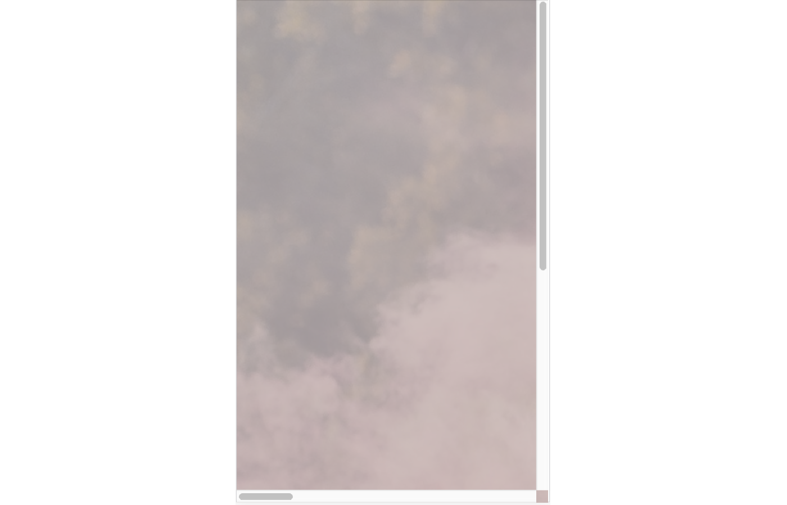
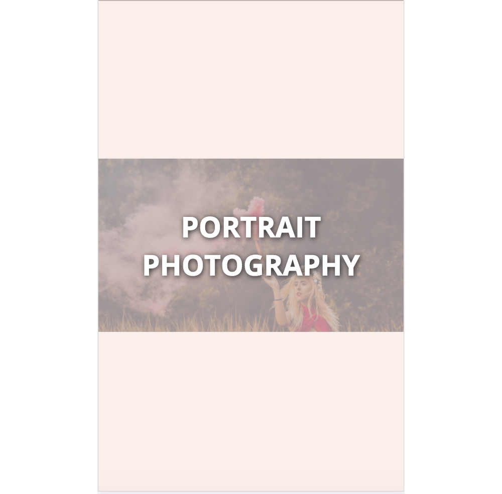
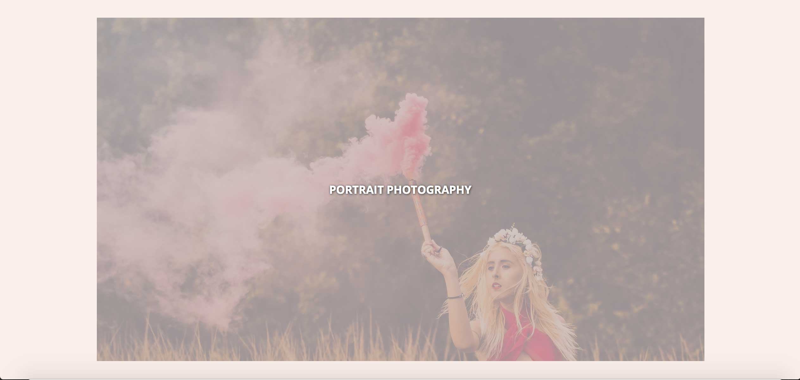

# Портрет

## Описание

Ваш знакомый — страшный романтик. Он решил сделать подарок своей жене на их годовщину и сверстал, как сумел, страницу с ее портретом.

Но вот беда! Если сузить окно браузера, то портрета почти не видно:

Друг попросил вас помочь ему сделать так, чтобы в окне браузера любой ширины портрет было видно полностью. В узком окне браузера:

И в широком:

## Процесс реализации

1. Переопределите свойство `width` блока с классом `container` так, чтобы он занимал всю доступную ширину окна браузера.

2. Задайте ширину блока с классом `poster` так, чтобы портрет занимал всю доступную ширину своего родителя.

3. Ограничьте ширину блока с классом `container`, чтобы он переставал тянуться, если ширина окна браузера больше `1920px`:

Не требуется вносить какие-либо другие правки в CSS или писать дополнительные правила. Также не изменяйте HTML-разметку.

## Реализация

В ходе решения этой задачи не изменяйте HTML-разметку.

Внесите изменения во вкладке CSS. Перед началом работы сделайте форк пена на [https://codepen.io/Netology/pen/LOPbzy](https://codepen.io/Netology/pen/LOPbzy?editors=0100#0)
