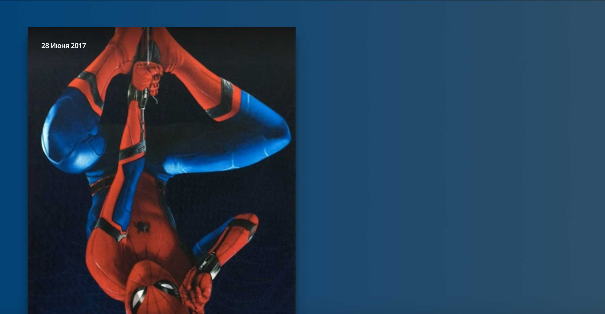
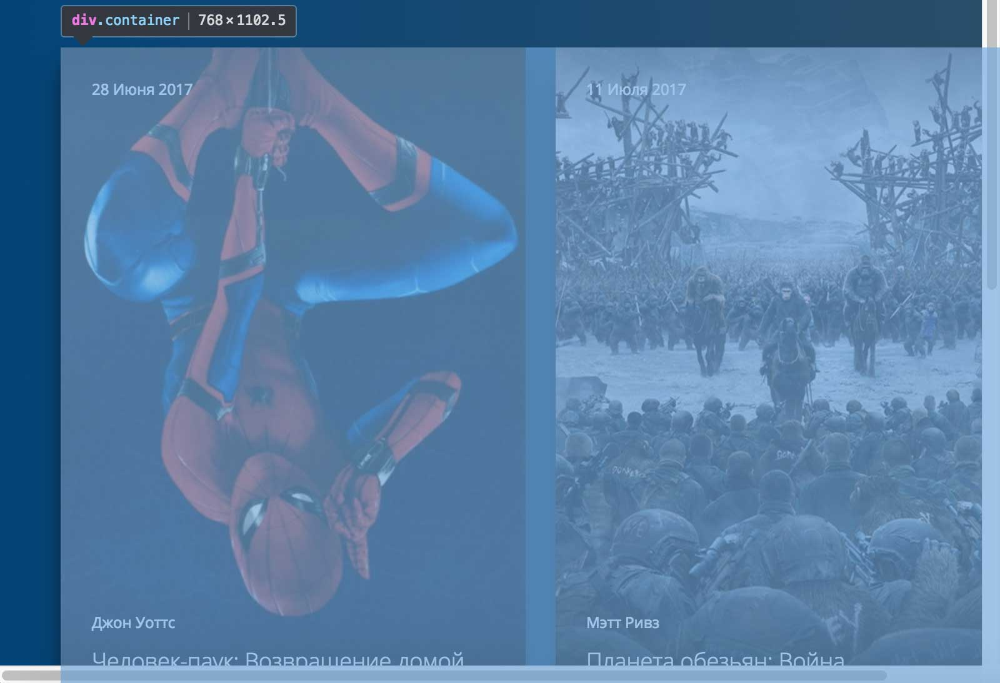

# Новинки кино

## Описание
У самого крупного кинотеатра в вашем городе обновился сайт. Предыдущий исполнитель уехал жить в Бурунди и не готов заниматься внесением правок. Вам предложили поддержку этого проекта с точки зрения верстки.

Сейчас, если сузить экран, две карточки не вмещаются в строчку:

В качестве тестового задания вам нужно сделать, чтобы две карточки помещались в строчку, начиная с ширины окна браузера `768px`, и сохранить при этом пропорции блоков на странице:

Для этого нужно сделать так, чтобы внешние отступы и ширина карточек кинофильмов менялись при изменении ширины родительского блока.

При сужении окна браузера ширина блока с классом `container` не должна становиться меньше `768px`, а когда этот блок перестанет вмещаться в окно браузера &mdash; должна появляться горизонтальная полоса прокрутки:

## Процесс реализации

1. Задайте внешний отступ справа для нечетных блоков с классом `card` в процентах, рассчитав значение так, чтобы при ширине блока с классом `container`, равной `1000px`, он был бы равен `15px`.

2. Задайте внешний отступ слева у четных элементов блоков с классом `card` в процентах, рассчитав значение так, чтобы при ширине блока с классом `container`, равной `1000px`, он также был бы равен `15px`.

3. Задайте внешний отступ снизу у всех элементов с классом `card` в процентах, рассчитав значение так, чтобы при ширине блока с классом `container`, равной `1000px`, он был бы равен `30px`.

4. Переопределите свойство `width` блоков с классом `card`, заменив значение в `px` на значение в процентах так, чтобы в строчку помещались две карточки с учетом новых значений отступов.

Проверить правильность решения можно, меняя ширину окна браузера и проверяя, чтобы две карточки располагались на одной строчке, начиная с ширины окна `768px`.

Не требуется вносить какие-либо другие правки в CSS или писать дополнительные правила. Также не изменяйте HTML-разметку.

## Реализация

В ходе решения этой задачи не изменяйте HTML-разметку.

Внесите изменения во вкладке CSS. Перед началом работы сделайте форк пена на [https://codepen.io/Netology/pen/rGEGvm](https://codepen.io/Netology/pen/rGEGvm?editors=0100#0)
