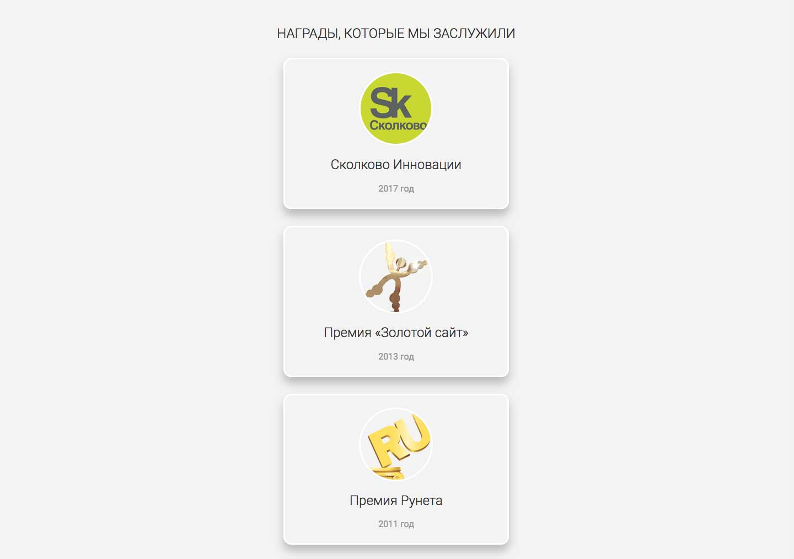

# Награды

## Описание
На посадочной странице, которую вы верстаете, есть блок с наградами компании. Изначально дизайнер решил расположить их в ряд в порядке возрастания даты получения награды.
Сейчас страница выглядит так:

Но в процессе приемки директор решил, что награды должны располагаться в столбик, в порядке от самой новой (вверху) до самой старой (внизу).
Cтраница при этом должна выглядеть так:

Вам нужно изменить расположение блоков наград только при помощи CSS.

При ширине блока с классом `container` меньше `1024px` должна появляться горизонтальная полоса прокрутки.

## Процесс реализации

1. С помощью CSS расположите блоки с классом `trophy` в колонку и поменяйте порядок вывода наград в соответствии с заданием.

2. Перепишите правило, задающее внешний отступ второго блока награды так, чтобы оно задавало отступы для всех блоков с классом `trophy`.
Запишите в новом правиле значения внешних левых и правых отступов блока. 
Рассчитайте их значения в `%` при известной ширине так, чтобы блоки располагались по центру, как это показано на макете. При этом нижний отступ каждого блока должен равняться `30px`:

Не требуется вносить какие-либо другие правки в CSS или писать дополнительные правила. Также не изменяйте HTML-разметку.

## Реализация

В ходе решения этой задачи не изменяйте HTML-разметку.

Внесите изменения во вкладке CSS. Перед началом работы сделайте форк пена на [https://codepen.io/Netology/pen/jGjGeq](https://codepen.io/Netology/pen/jGjGeq?editors=0100#0)
