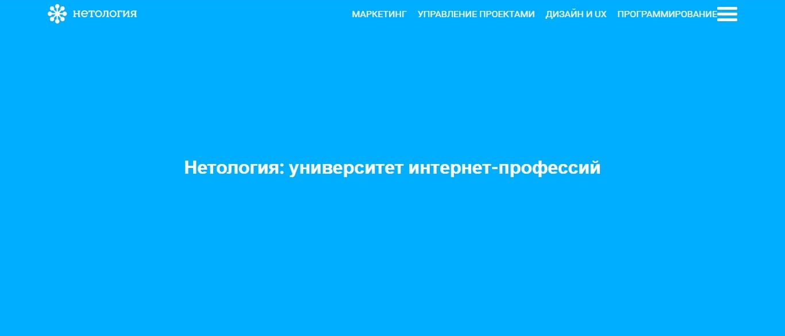
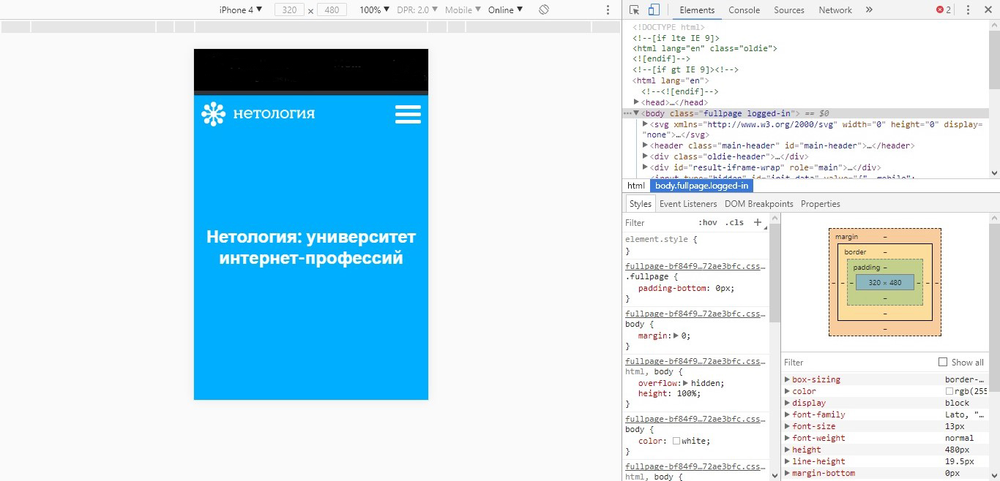

# Мобильное меню

## Описание

Компания «Нетология» предложила вам поучаствовать в интересном проекте — редизайне главной страницы корпоративного сайта. Предыдущий верстальщик работал над шапкой сайта и бросил дело на половине пути, оставив её в таком состоянии:
 

Вам требуется исправить ошибки в верстке так, чтобы на экранах с разными разрешениями использовалась различная навигация. На экранах с шириной дисплея более `641px` «гамбургер-меню» должно прятаться, чтобы страница отображалась так:

А на экранах мобильных устройств — с шириной дисплея менее `641px` — основное навигационное меню должно скрываться и заменяться «гамбургером», таким образом:

## Процесс реализации
1. В начале работы добавьте в тег `<head>` следующий мета-тег `<meta name="viewport" content="width=device-width, initial-scale=1.0">`.

2. Спрячьте кнопку «гамбургер» (элемент с классом `menu__button`) для устройств, у которых ширина экрана строго больше `640px`.

3. Заголовок с классом `title` должен иметь размер текста `45px` на устройствах, у которых ширина экрана строго больше `640px`.

4. Спрячьте элемент с классом `menu__list` на устройствах, у которых ширина экрана строго меньше `641px`.

5. На устройствах, у которых ширина экрана строго меньше `641px`, заголовок (элемент с классом `title`) должен иметь размер текста `24px`.

6. Протестируйте ваше решение в режиме эмуляции мобильных устройств, выбрав устройство iPhone 4:

6. Проверьте размер текста заголовка (элемента с классом `title`). Если все сделано правильно, он будет равен `24px`.

## Реализация

Внесите изменения во вкладке CSS. Перед началом работы сделайте форк пена на [https://codepen.io/Netology/pen/YEwjNq](https://codepen.io/Netology/pen/YEwjNq)
