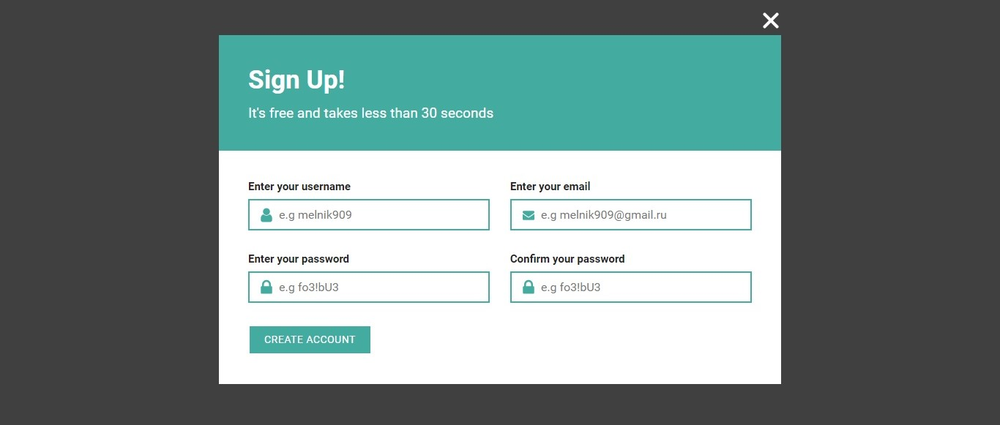
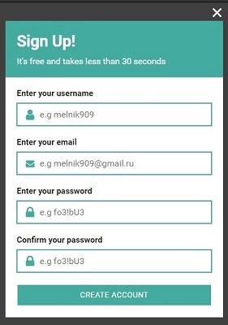
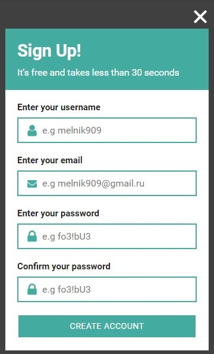
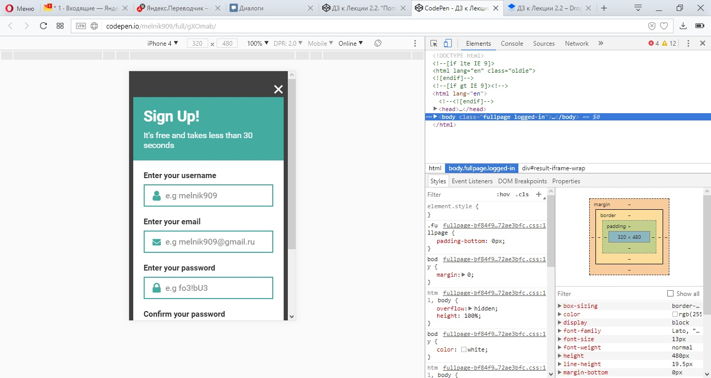

# Попап регистрации

## Описание

К вам обратилась американская компания. Для нее начали разрабатывать интернет-магазин, но подрядчик оказался недобросовестным и пропал, не закончив работу. Так компания вышла на вас. И в качестве первого задания нужно сверстать попап — всплывающее окно с формой регистрации. Вот макет окна для десктопных устройств:
 

А так попап должен выглядеть на мобильных устройствах:

В данный момент реализация выглядит так:

Вам нужно доверстать кнопку «закрыть» согласно дизайну.

## Процесс реализации
1. Если вы выполняете задание в песочнице CodePen - в начале работы добавьте в тег `<head>` следующий мета-тег `<meta name="viewport" content="width=device-width, initial-scale=1.0">`. Если вы выполняете задание локально - данный мета-тег уже добавлен.

2. В представленном коде перевести значения свойств `width`, `height` и `top` в единицы `em`. В итоге фактический размер кнопки по-прежнему должен быть `28x20px`.

3. Для устройств с шириной экрана меньше `481px` нужно уменьшить крестик — сделать его размером `21x15px`, не меняя свойства `width` и `height`.

4. Для устройств с шириной экрана больше `480px` оставить исходный размер кнопки — `28x20px`.

5. Протестируйте верстку в режиме эмуляции мобильных устройств, выбрав устройство iPhone 4:

5. Убедитесь, что размер кнопки «закрыть» для такого экрана равен `21x15px`.

## Реализация

Внесите изменения во вкладке CSS. Перед началом работы сделайте форк пена на [https://codepen.io/Netology/pen/JOGarN](https://codepen.io/Netology/pen/JOGarN)
