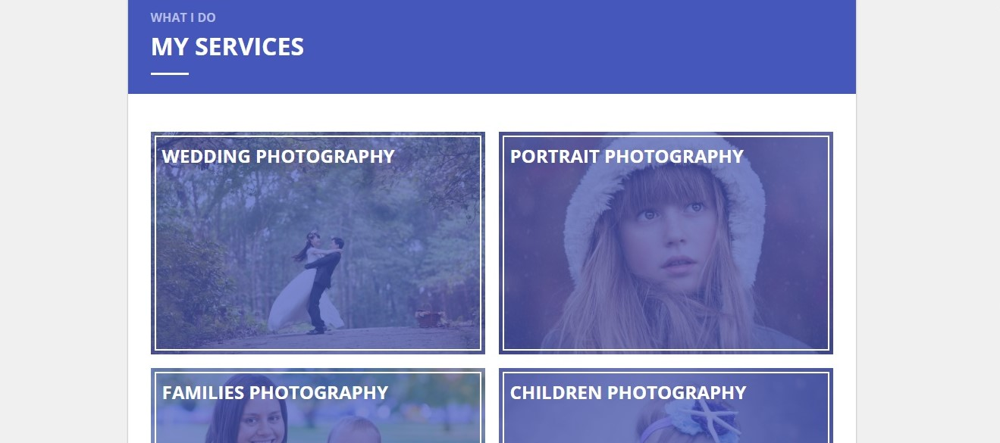
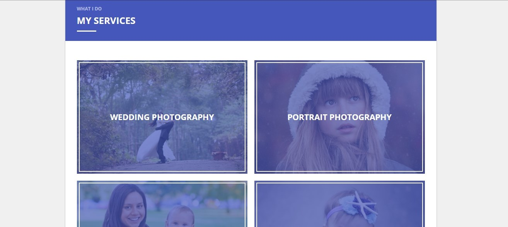
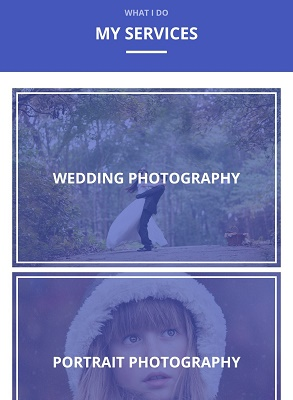
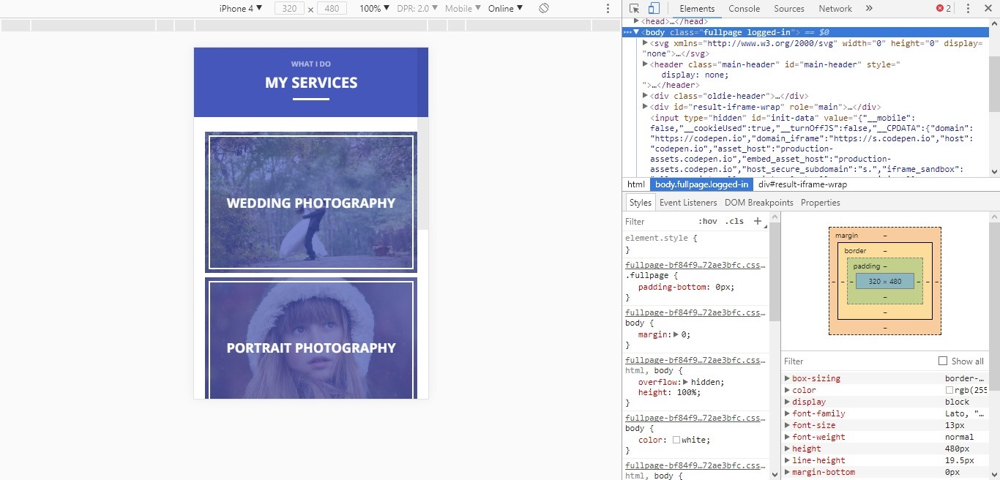

# Блок «Услуги» для персонального сайта фотографа

## Описание

Вместе с коллегой вы работаете над сайтом одного известного фотографа. Вы решили разделить обязанности — коллеге досталась верстка блока с услугами. Но через некоторое время выяснилось, что он не справляется и необходима помощь. Коллега передал вам верстку в таком состоянии:

Вам нужно исправить верстку блока, чтобы названия услуг переместились в центр изображений, и страница выглядела так:

Но это еще не всё: также нужно поработать над адаптивностью сайта. На устройствах с шириной экрана менее `481px` блок услуг должен отображаться так:

## Процесс реализации
1. В начале работы добавьте в тег `<head>` следующий мета-тег `<meta name="viewport" content="width=device-width, initial-scale=1.0">`. 

2. Отцентрируйте по горизонтали и вертикали названия услуг – элементы с классом `post__name`.

3. Установите размер шрифта для элемента с классом `section__header` так, чтобы размер шрифта элемента с классом `section__title` был `24px` для устройств с шириной экрана от `481px`, и `20px` — для устройств с шириной экрана до `480px`.

4. Установите размер шрифта для элемента с классом `post` так, чтобы размер шрифта элемента с классом `post__name` был `21px` для устройств с шириной экрана от `481px`, и `18px` — для устройств с шириной экрана до `480px`.

5. Протестируйте верстку в режиме эмуляции мобильных устройств, выбрав устройство iPhone 4:
 

5. Проверьте размер шрифта у элементов с классами `section__title` и `post__name`. Он должен соответствовать требованиям в задании: `20px` и `18px` соответственно.

## Реализация

Перед началом работы сделайте форк пена на [https://codepen.io/Netology/pen/ZaQjoP](https://codepen.io/Netology/pen/ZaQjoP)
Внесите изменения во вкладке CSS пена.
