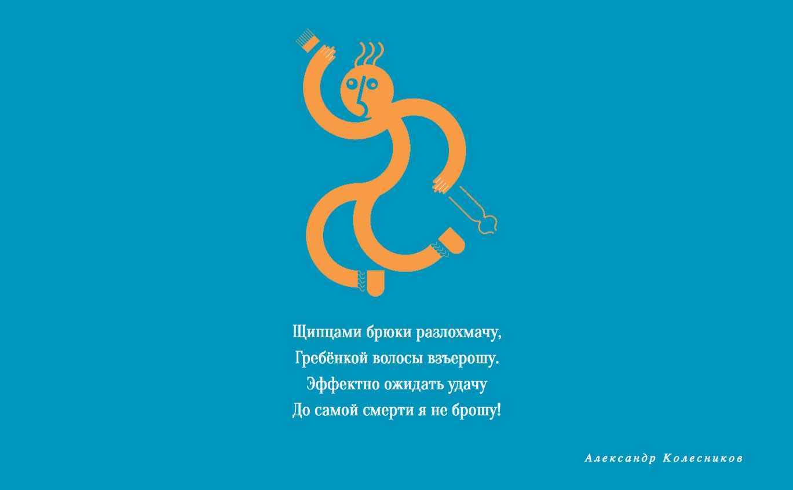
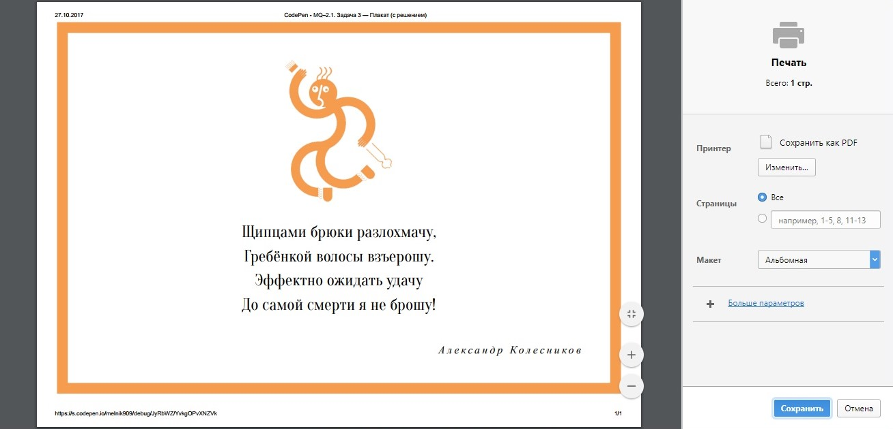
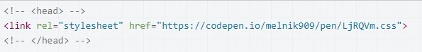
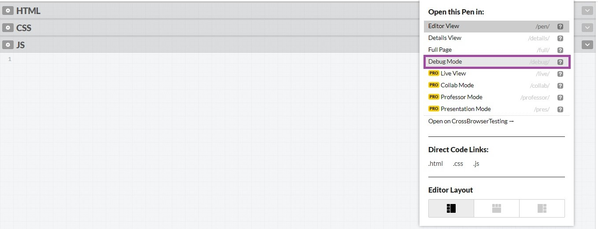

# Печать плаката

## Описание
Ваша компания подготовила забавный плакат к Международному дню родного языка. Планируется распечатать плакат и разослать его клиентам компании. Но есть клиенты, которые находятся очень далеко. Чтобы подарок попал к ним вовремя, решили сделать еще и веб-открытку.

Верстка в окне браузера выглядит так:

На случай, если кто-то из получателей электронной открытки захочет ее распечатать, вам нужно предусмотреть стили для печати, чтобы открытка выглядела аккуратно и празднично:

## Процесс реализации

1. Задайте цвет текста `#000000` для всей страницы.

2. Для всей страницы задайте сплошную рамку шириной `20px` цвета `#f69c4f`.

3. Для изображения с классом `poster` укажите ширину `200px`.

4. Измените HTML-разметку таким образом, чтобы стили из отдельного пена применялись только в режиме печати страницы.

5. Проверьте, что внешний вид верстки в обычном режиме не изменился:

6. Нажмите `Ctrl+P`/`⌘+P` или выберите «Печать...» в меню браузера.

7. В появившихся настройках выберите тип макета «Альбомная». Если ваше решение верно &mdash; вы увидите следующий результат:

Для тестирования используйте браузеры Chrome, Opera или Firefox. Результат в других браузерах может отличаться.

Не требуется вносить какие-либо другие правки в CSS и HTML, кроме описанных выше.

## Реализация

1. Создайте пустой пен (далее «пен 1»).

2. Из адресной строки скопируйте адрес нового пена

3. Сделайте форк пена на [https://codepen.io/Netology/pen/JOowLm](https://codepen.io/Netology/pen/JOowLm).

4. После комментария `<!-- head>` напишите тег `link`. В параметре `href` укажите скопированный адрес пена 1 и допишите в конце `.css`:

Стили из файла должны применяться только в режиме печати страницы. 

5. Напишите нужный для выполнения задания CSS в пене 1.

6. Для тестирования используйте браузеры Chrome, Opera или Firefox. Результат в других браузерах может отличаться.

Протестируйте ваше решение в форке задания, используя режим «Debug Mode»:

После включения режима «Debug Mode» откроется отдельная страница с примером.

7. На этой странице нажмите `Ctrl+P`/`⌘+P` или выберите «Печать...» в меню браузера и в появившихся настройках выберите тип макета «Альбомная».
Если ваше решение верно &mdash; вы увидите следующий результат:
   

Не требуется вносить какие-либо другие правки в CSS и HTML, кроме описанных выше.
