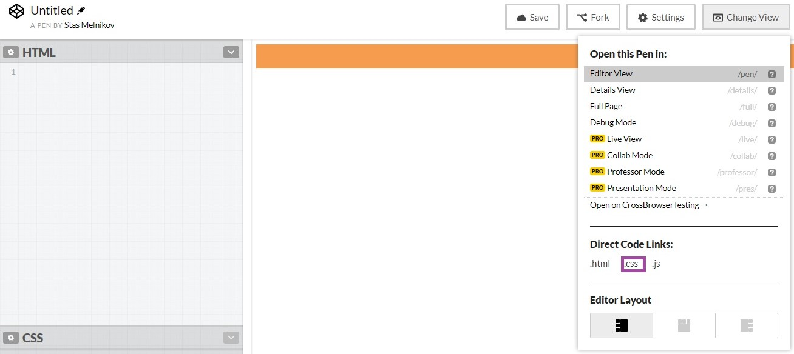

# Печать плаката

## Описание
Ваша компания подготовила забавный плакат к международному дню родного языка. Планируется распечатать плакат и разослать его клиентам компании. Но есть клиенты, которые находятся очень далеко. Чтобы подарок попал к ним вовремя, решили сделать еще и веб-открытку.

Верстка в окне браузера выглядит так:

На случай, если кто-то из получателей электронной открытки захочет ее распечатать, вам нужно предусмотреть стили для печати, чтобы открытка выглядела аккуратно и празднично:

## Процесс реализации

### Локально с использованием git

1. Задайте цвет текста `#000000` для всей страницы.

2. Для всей страницы задайте сплошную рамку шириной `20px` цвета `#f69c4f`.

3. Для изображения с классом `.poster` укажите ширину `200px`.

4. Нажмите `Ctrl+P`/`⌘+P` или выберите «Печать...» в меню браузера

5. В появившихся настройках выберите тип макета “Альбомная”. Если ваше решение верно &mdash; вы увидите следующий результат:

Не требуется вносить какие-либо другие правки в CSS и HTML, кроме описанных выше.

### В песочнице CodePen

1. Создайте пустой пен (далее “пен 1”)

2. Нажмите на пункт меню “Change View”

3. В разделе “Direct Code Links:” нажмите “.css”:

4. В новом окне откроется CSS-файл этого пена:
 

Вам нужно скопировать адрес файла из адресной строки.

5. Откройте пен с заданием и сделайте форк.

6. После комментария <!-- head> напишите тег link. В параметре href укажите скопированный адрес css-файла из пена 1:

Файл должен загружаться только в режиме печати страницы. 

7. Напишите нужный для выполнения задания css в пене 1.

8. Протестируйте ваше решение в форке задания, используя режим “Debug Mode”:

После включения режима “Debug Mode” откроется отдельная страница с примером.

9. На этой странице нажмите `Ctrl+P`/`⌘+P` или выберите «Печать...» в меню браузера и в появившихся настройках выберите тип макета “Альбомная”.
Если ваше решение верно &mdash; вы увидите следующий результат:
   

Не требуется вносить какие-либо другие правки в CSS и HTML, кроме описанных выше.

## Реализация

### Локально с использованием git

Внесите изменения в файл ./css/print-poster.css. Файл уже подключен к документу, поэтому другие файлы изменять не требуется.

### В песочнице CodePen

Создайте новый пен и скопируйте ссылку на css, как это описано выше. Перед началом работы сделайте форк пена на [https://codepen.io/Netology/pen/JOowLm](https://codepen.io/Netology/pen/JOowLm?editors=0100#0)
Внесите изменения во вкладке HTML пена задания. Внесите изменения во вкладке CSS пена 1.