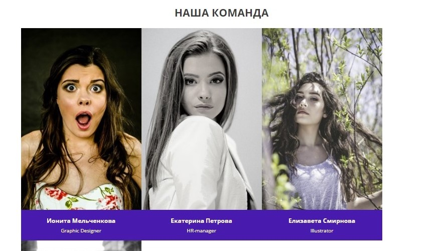
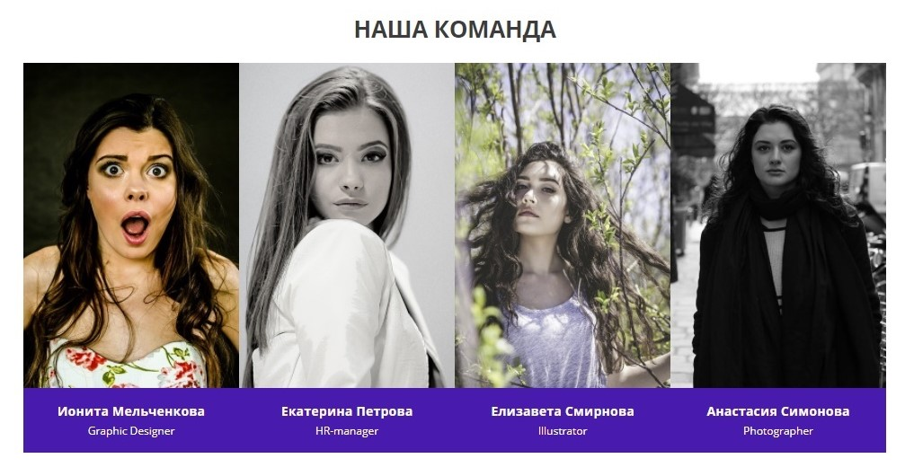
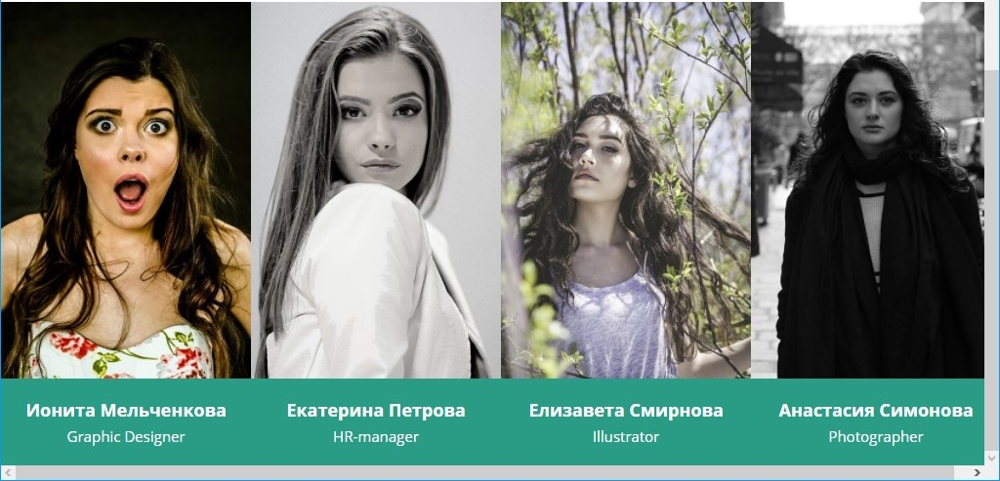

# Наша команда

## Описание

Вы работаете над сайтом веб-студии вместе с коллегой-верстальщиком. После разделения обязанностей ему достался блок «Наша команда». 

По семейным обстоятельствам он вынужден оставить проект на некоторое время и закончить работу над блоком придется вам. 
Сейчас карточки не помещаются в одну строку, и блок выглядит так:
 


Ваша задача &mdash; исправить верстку так, чтобы все четыре карточки располагались в одну строку в окне браузера шириной `1024px` и больше:



При ширине окна браузера меньше `1024px` должна появляться горизонтальная полоса прокрутки.

## Процесс реализации

1. Найдите причину переноса блока с классом `team__item` на новую строку в представленном коде:
 
```
.team {
  padding-top: 30px;
  min-width: 1024px;  
}

.team__container {
  display: flex;
  flex-wrap: wrap;
}

.team__item {
  width: 360px;
}
```

2. Не изменяя ширину блоков, исправьте приведенный выше CSS так, чтобы блоки расположились в ряд в окне браузера шириной `1024px` и больше:


3. Протестируйте ваше решение, изменяя размеры окна браузера. При сужении окна, как только его ширина станет меньше `1024px`, должна появляться горизонтальная полоса прокрутки. 
При этом заголовки блоков с классом `team__item` изменят цвет.



Не требуется вносить какие-либо другие правки в CSS или писать дополнительные правила.

## Реализация

Внесите изменения во вкладке CSS. Перед началом работы сделайте форк пена на [https://codepen.io/Netology/pen/eemOEa](https://codepen.io/Netology/pen/eemOEa?editors=0100#0)
