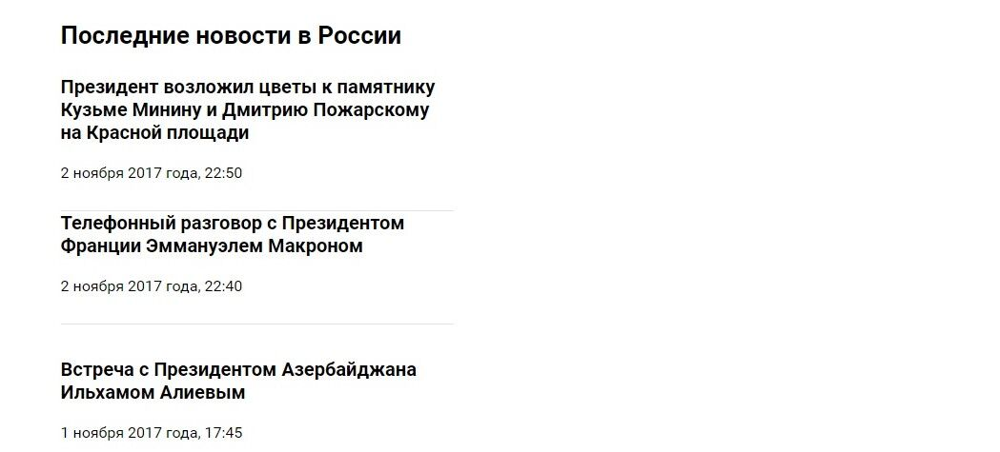
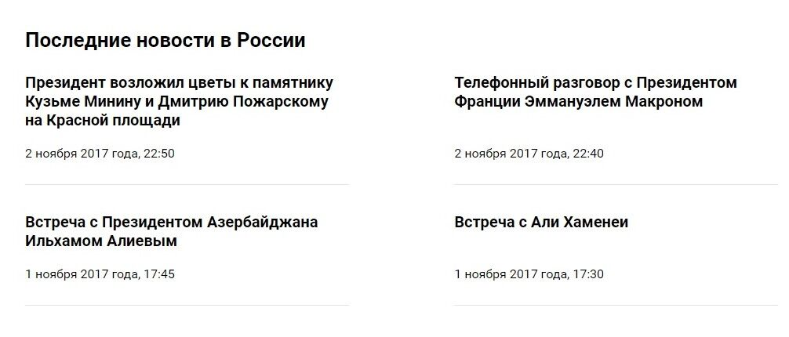
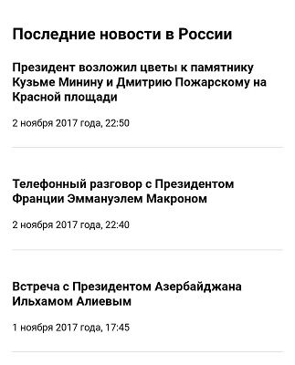

# Новостная лента

## Описание

За утренним кофе вы решили просмотреть новостную ленту на сайте `краткие-новости.рф`. Обычно вы читаете новости с мобильного телефона, но сейчас оказалось, что на экране ноутбука лента выглядит точно так же, как на телефоне:

Вы решили помочь любимому сайту и исправить верстку таким образом, чтобы для десктопных и мобильных устройств сайт выглядел по-разному, в соответствии с этими макетами. Макет для десктопных устройств:

Макет для мобильных устройств:

## Процесс реализации
1. В начале работы добавьте в тег `<head>` следующий метатег `<meta name="viewport" content="width=device-width, initial-scale=1.0">`. 

2. Для устройств с шириной экрана более `640px` расположите новости в две колонки, используя flexbox.

3. Карточки новостей должны прижиматься к краям элемента с классом `news__list`.

## Реализация

Внесите изменения во вкладке CSS. [Перед началом работы сделайте форк пена](https://codepen.io/Netology/pen/ooZWRZ).

Редактор CodePen больше недоступен в РФ. Если вы не можете сделать задание в нём, то предлагаем вам альтернативное решение - JS Bin. Создайте аккаунт, перенесите стили из репозитория GitHub и выполняйте задания в JS Bin. [Подробная инструкция](https://github.com/netology-code/guides/tree/master/jsbin)
