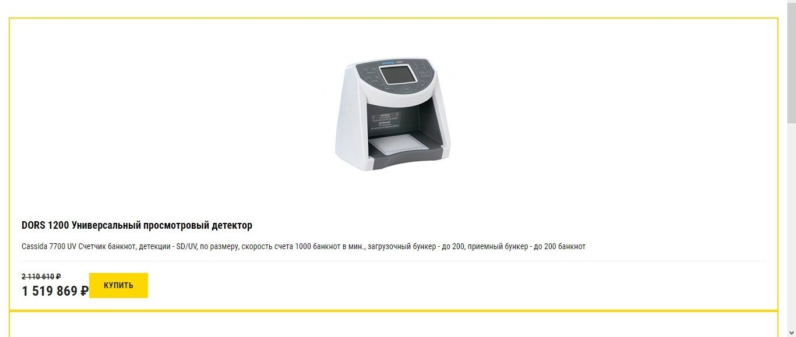
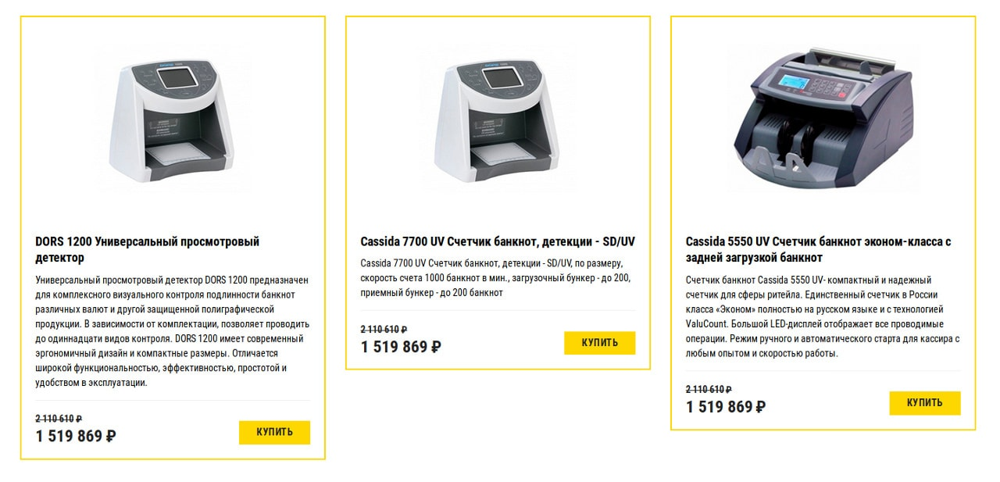
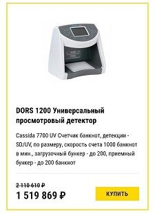

# Карточки товаров

## Описание

Вам поступил важный заказ: один из крупнейших интернет-магазинов по продаже торгового оборудования расширяет ассортимент — нужна новая страница для высокоточных устройств. Начинается сезон продаж, поэтому сверстать её нужно быстро. Клиент даже попытался сделать это самостоятельно, но не смог довести дело до конца. Сейчас страница выглядит так: 

Вам нужно исправить верстку, чтобы она корректно отображалась на десктопных и мобильных устройствах. Макет для десктопных устройств выглядит так:

А для мобильных устройств — так:

## Процесс реализации

1. Для устройств с шириной экрана от `769px` расположите карточки товара в ряд, используя flexbox. Ширина каждой карточки должна быть `32%`. Карточки должны быть прижаты к верхнему краю родительского блока.

2. Для устройств с шириной экрана от `769px` у второй, пятой, восьмой, одиннадцатой карточки и т.д. (то есть, у каждой третьей карточки, начиная с карточки номер 2) задайте недостающие отступы слева и справа.
 
3. Сделайте так, чтобы блок с ценой и кнопка «Купить» располагались по краям элемента с классом `product__footer`. 

4. Сделайте так, чтобы блок с ценой и кнопка «Купить» позиционировались по нижней границе элемента с классом `product__footer`.

## Реализация

### Локально с использованием git

Внесите изменения в файл `cards.css`. Файл уже подключен к документу, поэтому другие файлы изменять не требуется (не изменяйте файл `./css/cards-common.css`).

### В песочнице CodePen

Внесите изменения во вкладке CSS. Перед началом работы сделайте форк пена на [https://codepen.io/Netology/pen/MOpmYB](https://codepen.io/Netology/pen/MOpmYB)
