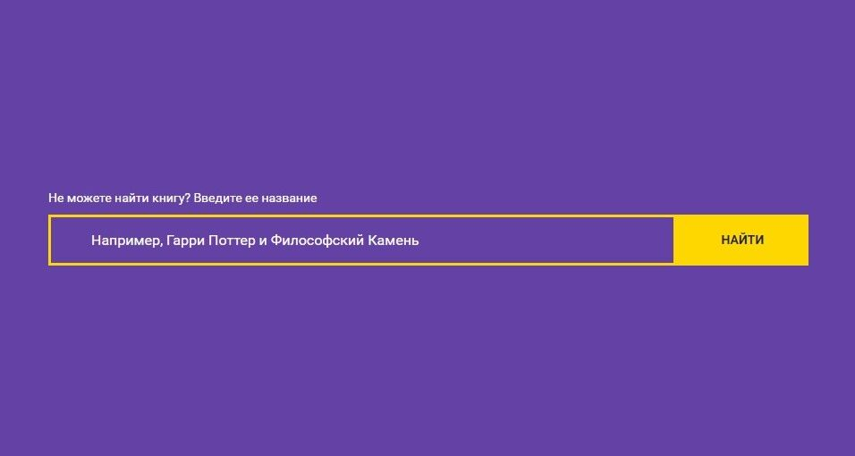
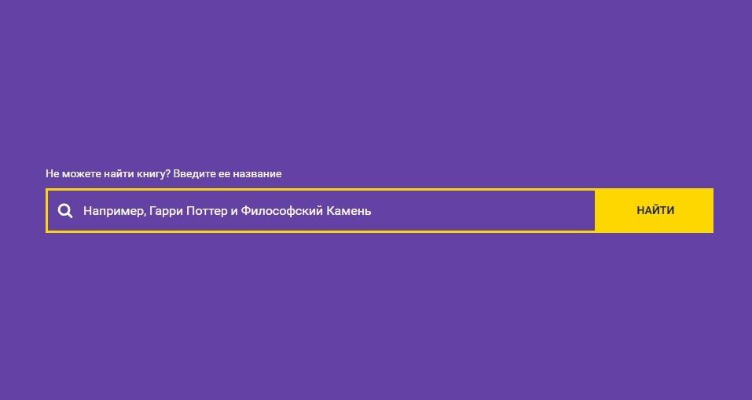
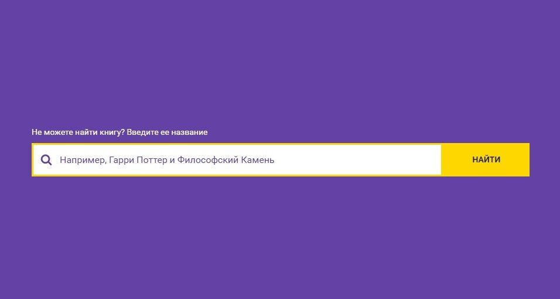

# Форма поиска для сайта книжного магазина

## Описание

Еще один крупный заказчик: компания «Читай-город» решила провести редизайн сайта и наняла вас для вёрстки. В качестве первого задания нужно доделать форму поиска. Текущее состояние формы такое:

Для наглядности в форму нужно добавить иконку лупы:

Также требуется реализовать смену цвета иконки при установке курсора в поле ввода:

## Процесс реализации
1. Если вы выполняете задание в песочнице CodePen, в начале работы добавьте в тег `<head>` следующий метатег `<meta name="viewport" content="width=device-width, initial-scale=1.0">`. Если вы выполняете задание локально, этот метатег уже добавлен.

2. Скачайте иконку лупы [по ссылке](https://netology-code.github.io/mq-homeworks/sources/search.svg).

3. Вставьте иконку в HTML-файл, добавив ей класс `search__icon`.

4. Задайте иконке белый цвет `#ffffff`.

5. При получении фокуса (псевдокласс `:focus`) полем ввода поменяйте цвет иконки на `#6441a5`.

## Реализация

[Перед началом работы сделайте форк пена](https://codepen.io/Netology/pen/ZaeKGq). Внесите изменения во вкладках HTML и CSS пена.

Редактор CodePen больше недоступен в РФ. Если вы не можете сделать задание в нём, то предлагаем вам альтернативное решение - JS Bin. Создайте аккаунт, перенесите стили из репозитория GitHub и выполняйте задания в JS Bin. [Подробная инструкция](https://github.com/netology-code/guides/tree/master/jsbin)
