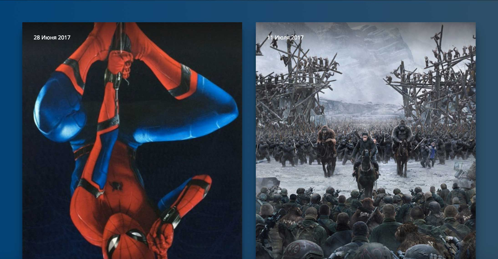

# Новинки кино

## Описание
У самого крупного кинотеатра в вашем городе обновился сайт. Предыдущий исполнитель уехал жить в Бурунди и не готов заниматься внесением правок. Вам предложили заняться поддержкой этого проекта с точки зрения верстки.

Сейчас, если сузить экран, то две карточки не вмещаются в строчку:

В качестве тестового задания вам нужно исправить это, чтобы две карточки помещались в строчку при любой ширине экрана:

Для этого нужно сделать так, чтобы внешние отступы и ширина карточек кинофильмов не были заданы жестко, а менялись при изменении ширины родительского блока.

## Процесс реализации

1. Задайте внешние отступы для нечетных блоков с классом `.card` в процентах, рассчитав значение так, чтобы при ширине экрана в `1280px` они были бы равны `15px`.

2. Задайте внешние отступы слева у четных элементов блоков с классом `.card` в процентах, рассчитав значение так, чтобы при ширине экрана в `1280px` они также были бы равны `15px`.

3. Задайте внешние отступы снизу у всех элементов с классом `.card` в процентах, рассчитав значение так, чтобы при ширине экрана в `1280px` они были бы равны `30px`.

4. Переопределите свойство width блоков с классом `.card`, заменив значение в px на значение в процентах так, чтобы в строчку помещались две карточки с учетом новых значений отступов.

Проверить правильность решения можно, измерив величину внешних отступов блоков на ширине экрана в `1280px`.

Не требуется вносить какие-либо другие правки в CSS или писать дополнительные правила. Также не изменяйте HTML-разметку.

## Реализация

В ходе решения этой задачи не изменяйте HTML-разметку.

### Локально с использованием git

Внесите изменения в файл ./css/poster.css. Файл уже подключен к документу, поэтому другие файлы изменять не требуется.

### В песочнице CodePen

Внесите изменения во вкладке CSS. Перед началом работы сделайте форк пена на [https://codepen.io/frontgirl/pen/jGoJPw](https://codepen.io/frontgirl/pen/jGoJPw?editors=0100#0)
